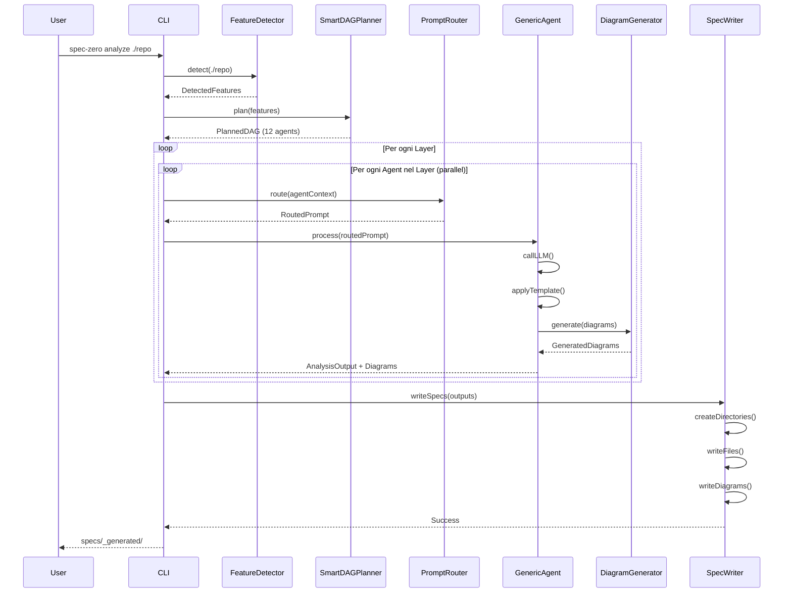

# SPEC-OS Plugin v2.1.0 - Architettura Intelligente

> **Data:** 2026-01-16
> **Versione:** 2.1.0
> **Decisioni Architetturali:**
> - Agenti Generici (guidati da prompt)
> - Diagrammi: inline + standalone
> - DAG: Smart Planner dinamico

---

## 1. VISIONE D'INSIEME

```
┌─────────────────────────────────────────────────────────────────────────────┐
│                         SPEC-OS PLUGIN v2.1.0                               │
├─────────────────────────────────────────────────────────────────────────────┤
│                                                                             │
│                         ┌──────────────────────┐                            │
│                         │   PROMPT REGISTRY    │                            │
│                         │   (Catalogo prompt)  │                            │
│                         └──────────┬───────────┘                            │
│                                    │                                        │
│                                    ▼                                        │
│  ┌─────────────┐          ┌──────────────────────┐          ┌───────────┐  │
│  │   FEATURE   │──────────│    PROMPT ROUTER     │──────────│  TEMPLATE │  │
│  │  DETECTOR   │          │  (Selezione prompt)  │          │   LOADER  │  │
│  └─────────────┘          └──────────┬───────────┘          └───────────┘  │
│         │                            │                            │         │
│         │                            ▼                            │         │
│         │                 ┌──────────────────────┐               │         │
│         └────────────────▶│  SMART DAG PLANNER   │◀──────────────┘         │
│                           │  (DAG dinamico)      │                          │
│                           └──────────┬───────────┘                          │
│                                      │                                      │
│                                      ▼                                      │
│                           ┌──────────────────────┐                          │
│                           │    DAG EXECUTOR      │                          │
│                           └──────────┬───────────┘                          │
│                                      │                                      │
│                    ┌─────────────────┼─────────────────┐                    │
│                    ▼                 ▼                 ▼                    │
│           ┌──────────────┐  ┌──────────────┐  ┌──────────────┐             │
│           │   GENERIC    │  │   GENERIC    │  │   GENERIC    │             │
│           │    AGENT     │  │    AGENT     │  │    AGENT     │             │
│           │  (api/*)     │  │  (data/*)    │  │  (ui/*)      │             │
│           └──────────────┘  └──────────────┘  └──────────────┘             │
│                    │                 │                 │                    │
│                    ▼                 ▼                 ▼                    │
│           ┌──────────────────────────────────────────────────┐             │
│           │              DIAGRAM GENERATOR                    │             │
│           │  (Mermaid: sequence, flowchart, erd, state)      │             │
│           └──────────────────────────────────────────────────┘             │
│                                      │                                      │
│                                      ▼                                      │
│                           ┌──────────────────────┐                          │
│                           │    SPEC WRITER       │                          │
│                           │  (_generated/ + .mmd)│                          │
│                           └──────────────────────┘                          │
│                                                                             │
└─────────────────────────────────────────────────────────────────────────────┘
```

---

## 2. COMPONENTI CORE

### 2.1 Prompt Registry

**File:** `src/core/prompt-registry.ts`

Catalogo centralizzato di tutti i prompt con metadata per routing intelligente.

```typescript
/**
 * PromptRegistry - Catalogo centralizzato dei prompt
 * 
 * Ogni prompt ha metadata che permettono al Router di:
 * - Sapere quando e applicabile (repo type, features)
 * - Sapere cosa richiede (dipendenze)
 * - Sapere cosa produce (output)
 * - Sapere che diagrammi generare
 */

export type RepoType = 
    | 'backend' 
    | 'frontend' 
    | 'fullstack' 
    | 'library' 
    | 'cli' 
    | 'monorepo'
    | 'mobile'
    | 'unknown';

export type DiagramType = 
    | 'sequence'      // Flussi API, auth, comunicazione
    | 'flowchart'     // Logica, decisioni, routing
    | 'erd'           // Entity Relationship
    | 'classDiagram'  // Struttura classi/tipi
    | 'stateDiagram'  // State machine
    | 'c4'            // C4 architecture
    | 'gantt'         // Timeline/roadmap
    | 'pie';          // Distribuzione

export type PromptCategory = 
    | 'analysis'      // Analisi esplorativa
    | 'document'      // Documentazione spec
    | 'audit'         // Confronto/validazione
    | 'diagram'       // Solo generazione diagrammi
    | 'template';     // Riempimento template

export interface PromptDefinition {
    /** ID univoco: "category/name" es: "api/detect-endpoints" */
    id: string;
    
    /** Categoria prompt */
    category: PromptCategory;
    
    /** Tipi di repo a cui si applica */
    applicableTo: RepoType[];
    
    /** Features che devono essere rilevate per usare questo prompt */
    requiredFeatures?: string[];
    
    /** Agenti/prompt che devono essere completati prima */
    dependsOn: string[];
    
    /** Cosa produce questo prompt (usato per dipendenze) */
    produces: string[];
    
    /** Template da usare per formattare output */
    templateId?: string;
    
    /** Diagrammi da generare */
    diagrams: DiagramType[];
    
    /** Output file name (senza path) */
    outputFile: string;
    
    /** Priorita (per ordinamento se multipli match) */
    priority: number;
    
    /** Flag: opzionale se features mancanti */
    optional: boolean;
}

export interface LoadedPrompt {
    definition: PromptDefinition;
    content: string;
    version: string;
    hash: string;
}

export class PromptRegistry {
    private prompts: Map<string, PromptDefinition> = new Map();
    private promptsDir: string;
    private cache: Map<string, LoadedPrompt> = new Map();

    constructor(pluginRoot: string) {
        this.promptsDir = path.join(pluginRoot, 'prompts');
        this.loadDefinitions();
    }

    /**
     * Carica tutte le definizioni da prompts/_registry.json
     */
    private loadDefinitions(): void {
        const registryPath = path.join(this.promptsDir, '_registry.json');
        if (fs.existsSync(registryPath)) {
            const definitions: PromptDefinition[] = JSON.parse(
                fs.readFileSync(registryPath, 'utf-8')
            );
            for (const def of definitions) {
                this.prompts.set(def.id, def);
            }
        }
    }

    /**
     * Trova prompt applicabili per contesto
     */
    findApplicable(
        repoType: RepoType,
        detectedFeatures: Set<string>,
        completedPrompts: Set<string>
    ): PromptDefinition[] {
        const applicable: PromptDefinition[] = [];
        
        for (const def of this.prompts.values()) {
            // Check repo type
            if (!def.applicableTo.includes(repoType) && 
                !def.applicableTo.includes('unknown')) {
                continue;
            }
            
            // Check required features
            if (def.requiredFeatures) {
                const hasAllFeatures = def.requiredFeatures.every(
                    f => detectedFeatures.has(f)
                );
                if (!hasAllFeatures && !def.optional) {
                    continue;
                }
            }
            
            // Check dependencies satisfied
            const depsOk = def.dependsOn.every(
                d => completedPrompts.has(d) || d === 'bootstrap'
            );
            if (!depsOk) {
                continue;
            }
            
            applicable.push(def);
        }
        
        // Sort by priority
        return applicable.sort((a, b) => b.priority - a.priority);
    }

    /**
     * Carica contenuto prompt
     */
    load(promptId: string): LoadedPrompt {
        if (this.cache.has(promptId)) {
            return this.cache.get(promptId)!;
        }
        
        const def = this.prompts.get(promptId);
        if (!def) {
            throw new Error(`Prompt ${promptId} not found in registry`);
        }
        
        const promptPath = path.join(this.promptsDir, `${promptId}.md`);
        if (!fs.existsSync(promptPath)) {
            throw new Error(`Prompt file not found: ${promptPath}`);
        }
        
        const rawContent = fs.readFileSync(promptPath, 'utf-8');
        const version = this.extractVersion(rawContent);
        const content = this.stripMeta(rawContent);
        const hash = crypto.createHash('md5')
            .update(rawContent)
            .digest('hex')
            .slice(0, 8);
        
        const loaded: LoadedPrompt = {
            definition: def,
            content,
            version,
            hash
        };
        
        this.cache.set(promptId, loaded);
        return loaded;
    }

    /**
     * Ottieni definizione
     */
    get(promptId: string): PromptDefinition | undefined {
        return this.prompts.get(promptId);
    }

    /**
     * Lista tutti i prompt
     */
    list(): PromptDefinition[] {
        return Array.from(this.prompts.values());
    }

    private extractVersion(content: string): string {
        const match = content.match(/^<!--\s*version[=:]\s*(\d+)\s*-->/);
        return match ? match[1] : '1';
    }

    private stripMeta(content: string): string {
        return content.replace(/^<!--[\s\S]*?-->\n?/, '');
    }
}
```

---

### 2.2 Feature Detector

**File:** `src/core/feature-detector.ts`

Rileva features del repository per guidare il DAG planning.

```typescript
/**
 * FeatureDetector - Rileva caratteristiche del repository
 * 
 * Analisi veloce per determinare:
 * - Tipo di progetto
 * - Framework usati
 * - Features presenti (API, DB, Auth, etc.)
 */

export interface DetectedFeatures {
    // Tipo progetto
    repoType: RepoType;
    
    // Linguaggi
    languages: Set<string>;
    
    // Framework
    frameworks: Set<string>;
    
    // Features booleane
    features: Set<string>;
    
    // Struttura
    structure: {
        hasBackend: boolean;
        hasFrontend: boolean;
        hasTests: boolean;
        hasDocs: boolean;
        hasDocker: boolean;
        hasCICD: boolean;
        isMonorepo: boolean;
    };
    
    // Metadata
    packageManager?: 'npm' | 'yarn' | 'pnpm' | 'pip' | 'cargo';
    entryPoints: string[];
}

// Feature flags usati per routing
export const FEATURE_FLAGS = {
    // API
    HAS_REST_API: 'has_rest_api',
    HAS_GRAPHQL: 'has_graphql',
    HAS_WEBSOCKET: 'has_websocket',
    HAS_GRPC: 'has_grpc',
    
    // Database
    HAS_SQL_DB: 'has_sql_db',
    HAS_NOSQL_DB: 'has_nosql_db',
    HAS_ORM: 'has_orm',
    HAS_MIGRATIONS: 'has_migrations',
    
    // Auth
    HAS_AUTH: 'has_auth',
    HAS_OAUTH: 'has_oauth',
    HAS_JWT: 'has_jwt',
    HAS_RBAC: 'has_rbac',
    
    // Frontend
    HAS_REACT: 'has_react',
    HAS_VUE: 'has_vue',
    HAS_ANGULAR: 'has_angular',
    HAS_STATE_MGMT: 'has_state_mgmt',
    HAS_ROUTING: 'has_routing',
    
    // Infra
    HAS_DOCKER: 'has_docker',
    HAS_K8S: 'has_k8s',
    HAS_SERVERLESS: 'has_serverless',
    HAS_CICD: 'has_cicd',
    
    // Quality
    HAS_TESTS: 'has_tests',
    HAS_LINTING: 'has_linting',
    HAS_TYPES: 'has_types',
} as const;

export class FeatureDetector {
    /**
     * Rileva tutte le features di un repository
     */
    async detect(repoPath: string): Promise<DetectedFeatures> {
        const features = new Set<string>();
        const languages = new Set<string>();
        const frameworks = new Set<string>();
        
        // 1. Analizza package.json / requirements.txt
        await this.detectFromPackageFiles(repoPath, features, frameworks);
        
        // 2. Analizza struttura directory
        const structure = await this.detectStructure(repoPath);
        
        // 3. Rileva linguaggi
        await this.detectLanguages(repoPath, languages);
        
        // 4. Pattern matching su file chiave
        await this.detectPatterns(repoPath, features);
        
        // 5. Determina repo type
        const repoType = this.determineRepoType(structure, features, frameworks);
        
        return {
            repoType,
            languages,
            frameworks,
            features,
            structure,
            packageManager: await this.detectPackageManager(repoPath),
            entryPoints: await this.findEntryPoints(repoPath)
        };
    }

    private async detectFromPackageFiles(
        repoPath: string,
        features: Set<string>,
        frameworks: Set<string>
    ): Promise<void> {
        // package.json
        const pkgPath = path.join(repoPath, 'package.json');
        if (fs.existsSync(pkgPath)) {
            const pkg = JSON.parse(fs.readFileSync(pkgPath, 'utf-8'));
            const allDeps = {
                ...pkg.dependencies,
                ...pkg.devDependencies
            };
            
            // Frameworks
            if (allDeps['express']) frameworks.add('express');
            if (allDeps['fastify']) frameworks.add('fastify');
            if (allDeps['react']) frameworks.add('react');
            if (allDeps['vue']) frameworks.add('vue');
            if (allDeps['@angular/core']) frameworks.add('angular');
            if (allDeps['next']) frameworks.add('nextjs');
            if (allDeps['nuxt']) frameworks.add('nuxt');
            
            // Features
            if (allDeps['prisma'] || allDeps['@prisma/client']) {
                features.add(FEATURE_FLAGS.HAS_ORM);
                features.add(FEATURE_FLAGS.HAS_SQL_DB);
            }
            if (allDeps['mongoose'] || allDeps['mongodb']) {
                features.add(FEATURE_FLAGS.HAS_NOSQL_DB);
            }
            if (allDeps['@apollo/server'] || allDeps['graphql']) {
                features.add(FEATURE_FLAGS.HAS_GRAPHQL);
            }
            if (allDeps['socket.io'] || allDeps['ws']) {
                features.add(FEATURE_FLAGS.HAS_WEBSOCKET);
            }
            if (allDeps['jsonwebtoken'] || allDeps['jose']) {
                features.add(FEATURE_FLAGS.HAS_JWT);
                features.add(FEATURE_FLAGS.HAS_AUTH);
            }
            if (allDeps['passport']) {
                features.add(FEATURE_FLAGS.HAS_AUTH);
                features.add(FEATURE_FLAGS.HAS_OAUTH);
            }
            if (allDeps['zustand'] || allDeps['redux'] || allDeps['mobx']) {
                features.add(FEATURE_FLAGS.HAS_STATE_MGMT);
            }
        }
        
        // requirements.txt / pyproject.toml per Python
        // Cargo.toml per Rust
        // etc.
    }

    private async detectStructure(repoPath: string): Promise<DetectedFeatures['structure']> {
        const exists = (p: string) => fs.existsSync(path.join(repoPath, p));
        
        return {
            hasBackend: exists('src/server') || exists('backend') || exists('api') || 
                       exists('src/handlers') || exists('src/routes'),
            hasFrontend: exists('src/components') || exists('frontend') || exists('app') ||
                        exists('pages') || exists('src/views'),
            hasTests: exists('tests') || exists('__tests__') || exists('test') ||
                     exists('spec') || exists('src/__tests__'),
            hasDocs: exists('docs') || exists('documentation') || exists('doc'),
            hasDocker: exists('Dockerfile') || exists('docker-compose.yml') ||
                      exists('docker-compose.yaml'),
            hasCICD: exists('.github/workflows') || exists('.gitlab-ci.yml') ||
                    exists('Jenkinsfile') || exists('.circleci'),
            isMonorepo: exists('packages') || exists('apps') || exists('libs') ||
                       exists('workspaces') || exists('pnpm-workspace.yaml')
        };
    }

    private determineRepoType(
        structure: DetectedFeatures['structure'],
        features: Set<string>,
        frameworks: Set<string>
    ): RepoType {
        if (structure.isMonorepo) return 'monorepo';
        
        const hasApi = features.has(FEATURE_FLAGS.HAS_REST_API) || 
                      features.has(FEATURE_FLAGS.HAS_GRAPHQL);
        const hasDb = features.has(FEATURE_FLAGS.HAS_SQL_DB) || 
                     features.has(FEATURE_FLAGS.HAS_NOSQL_DB);
        
        if (structure.hasBackend && structure.hasFrontend) return 'fullstack';
        if (structure.hasBackend || hasApi || hasDb) return 'backend';
        if (structure.hasFrontend) return 'frontend';
        if (frameworks.has('react-native') || frameworks.has('flutter')) return 'mobile';
        if (!structure.hasBackend && !structure.hasFrontend) return 'library';
        
        return 'unknown';
    }
}
```

---

### 2.3 Prompt Router

**File:** `src/core/prompt-router.ts`

Decide quali prompt usare e li compone per gli agenti.

```typescript
/**
 * PromptRouter - Routing intelligente dei prompt
 * 
 * Responsabilita:
 * 1. Selezionare prompt appropriati per contesto
 * 2. Comporre prompt con base + specifico + output schema
 * 3. Aggiungere istruzioni per diagrammi
 * 4. Fornire template da usare
 */

export interface RoutingContext {
    repoType: RepoType;
    detectedFeatures: DetectedFeatures;
    completedAgents: Set<string>;
    previousOutputs: Map<string, string>;  // summaries
    currentAgentId: string;
}

export interface RoutedPrompt {
    /** Prompt di sistema (ruolo + guidelines) */
    systemPrompt: string;
    
    /** Prompt specifico per l'analisi */
    analysisPrompt: string;
    
    /** Schema output (formato SPEC-OS) */
    outputSchema: string;
    
    /** Istruzioni per diagrammi */
    diagramInstructions: DiagramInstruction[];
    
    /** Template ID da usare */
    templateId?: string;
    
    /** Metadata per tracciabilita */
    metadata: {
        promptId: string;
        version: string;
        hash: string;
    };
}

export interface DiagramInstruction {
    type: DiagramType;
    description: string;
    outputFile: string;
    inline: boolean;  // Anche inline nel doc
}

export class PromptRouter {
    constructor(
        private registry: PromptRegistry,
        private templateLoader: TemplateLoader
    ) {}

    /**
     * Route: seleziona e compone prompt per un agente
     */
    route(context: RoutingContext): RoutedPrompt {
        // 1. Trova prompt applicabile
        const definition = this.selectPrompt(context);
        
        // 2. Carica contenuto
        const loaded = this.registry.load(definition.id);
        
        // 3. Carica componenti base
        const baseSystem = this.loadBaseSystem(context.repoType);
        const outputSchema = this.loadOutputSchema();
        
        // 4. Costruisci contesto da agenti precedenti
        const previousContext = this.buildPreviousContext(
            context.previousOutputs,
            definition.dependsOn
        );
        
        // 5. Prepara istruzioni diagrammi
        const diagramInstructions = this.buildDiagramInstructions(
            definition.diagrams,
            definition.id
        );
        
        // 6. Componi prompt finale
        return {
            systemPrompt: this.composeSystemPrompt(baseSystem, context.repoType),
            analysisPrompt: this.composeAnalysisPrompt(
                loaded.content,
                previousContext,
                diagramInstructions
            ),
            outputSchema,
            diagramInstructions,
            templateId: definition.templateId,
            metadata: {
                promptId: definition.id,
                version: loaded.version,
                hash: loaded.hash
            }
        };
    }

    private selectPrompt(context: RoutingContext): PromptDefinition {
        const applicable = this.registry.findApplicable(
            context.repoType,
            context.detectedFeatures.features,
            context.completedAgents
        );
        
        // Filtra per agente corrente (match su produces)
        const forAgent = applicable.filter(p => 
            p.produces.some(prod => prod.includes(context.currentAgentId))
        );
        
        if (forAgent.length === 0) {
            throw new Error(
                `No prompt found for agent ${context.currentAgentId} ` +
                `in repo type ${context.repoType}`
            );
        }
        
        return forAgent[0]; // Gia ordinato per priorita
    }

    private loadBaseSystem(repoType: RepoType): string {
        try {
            const loaded = this.registry.load('_base/system');
            return loaded.content;
        } catch {
            return this.getDefaultSystemPrompt();
        }
    }

    private loadOutputSchema(): string {
        try {
            const loaded = this.registry.load('_base/output-format');
            return loaded.content;
        } catch {
            return this.getDefaultOutputSchema();
        }
    }

    private buildPreviousContext(
        outputs: Map<string, string>,
        dependencies: string[]
    ): string {
        if (dependencies.length === 0) return '';
        
        const sections: string[] = ['## Context from Previous Analyses\n'];
        
        for (const dep of dependencies) {
            const summary = outputs.get(dep);
            if (summary) {
                sections.push(`### From ${dep}:\n${summary}\n`);
            }
        }
        
        return sections.join('\n');
    }

    private buildDiagramInstructions(
        types: DiagramType[],
        promptId: string
    ): DiagramInstruction[] {
        return types.map(type => ({
            type,
            description: this.getDiagramDescription(type),
            outputFile: `${promptId.replace('/', '-')}-${type}.mmd`,
            inline: true  // Sempre anche inline
        }));
    }

    private getDiagramDescription(type: DiagramType): string {
        const descriptions: Record<DiagramType, string> = {
            sequence: 'Genera un sequence diagram per i flussi principali',
            flowchart: 'Genera un flowchart per la logica/decisioni',
            erd: 'Genera un ERD per le relazioni tra entita',
            classDiagram: 'Genera un class diagram per la struttura tipi',
            stateDiagram: 'Genera un state diagram per le transizioni',
            c4: 'Genera un C4 diagram per architettura',
            gantt: 'Genera un gantt per timeline',
            pie: 'Genera un pie chart per distribuzioni'
        };
        return descriptions[type] || '';
    }

    private composeSystemPrompt(base: string, repoType: RepoType): string {
        return `${base}

## Repository Context
- Type: ${repoType}
- Analysis Mode: SPEC-OS compliant output

## Your Role
You are an expert code analyst specializing in ${repoType} repositories.
Analyze thoroughly and provide accurate, well-structured documentation.
`;
    }

    private composeAnalysisPrompt(
        specific: string,
        previousContext: string,
        diagrams: DiagramInstruction[]
    ): string {
        let prompt = '';
        
        if (previousContext) {
            prompt += previousContext + '\n---\n\n';
        }
        
        prompt += specific;
        
        if (diagrams.length > 0) {
            prompt += '\n\n## Required Diagrams\n\n';
            for (const d of diagrams) {
                prompt += `### ${d.type}\n${d.description}\n\n`;
                prompt += this.getDiagramTemplate(d.type);
                prompt += '\n\n';
            }
        }
        
        return prompt;
    }

    private getDiagramTemplate(type: DiagramType): string {
        const templates: Record<DiagramType, string> = {
            sequence: `\`\`\`mermaid
sequenceDiagram
    participant A as Actor
    participant S as System
    A->>S: Request
    S-->>A: Response
\`\`\``,
            flowchart: `\`\`\`mermaid
flowchart TD
    A[Start] --> B{Decision}
    B -->|Yes| C[Action]
    B -->|No| D[Other]
\`\`\``,
            erd: `\`\`\`mermaid
erDiagram
    ENTITY1 ||--o{ ENTITY2 : has
    ENTITY1 {
        string id PK
        string name
    }
\`\`\``,
            classDiagram: `\`\`\`mermaid
classDiagram
    class ClassName {
        +property: type
        +method(): returnType
    }
\`\`\``,
            stateDiagram: `\`\`\`mermaid
stateDiagram-v2
    [*] --> State1
    State1 --> State2
    State2 --> [*]
\`\`\``,
            c4: `\`\`\`mermaid
C4Context
    Person(user, "User")
    System(system, "System")
    Rel(user, system, "Uses")
\`\`\``,
            gantt: `\`\`\`mermaid
gantt
    title Timeline
    section Phase
    Task1 :a1, 2024-01-01, 30d
\`\`\``,
            pie: `\`\`\`mermaid
pie title Distribution
    "A" : 40
    "B" : 60
\`\`\``
        };
        return templates[type] || '';
    }

    private getDefaultSystemPrompt(): string {
        return `You are an expert code analyst. Analyze repositories thoroughly 
and provide accurate, well-structured documentation in SPEC-OS format.`;
    }

    private getDefaultOutputSchema(): string {
        return `## Output Format (MANDATORY)

Every output MUST include:

### YAML Frontmatter
\`\`\`yaml
---
uid: {project}:spec:{section}
title: "{Title}"
status: draft
version: 1.0.0
created: {date}
prompt_version: {prompt-id}@v{version}
edges:
  - [[{project}:spec:{related}|{edge_type}]]
tags: [spec, {category}]
---
\`\`\`

### Content Structure
- Use H2 (##) for main sections
- Use H3 (###) for subsections
- Include code blocks with language tags
- Use tables for structured data
- Include Mermaid diagrams where appropriate

### Citation Rules
- ALWAYS cite file paths: \`src/file.ts:42\`
- NEVER invent information
- Write "NOT_FOUND" if data unavailable
`;
    }
}
```

---

### 2.4 Smart DAG Planner

**File:** `src/core/smart-dag-planner.ts`

Costruisce DAG dinamico basato sulle features rilevate.

```typescript
/**
 * SmartDAGPlanner - Costruisce DAG dinamico
 * 
 * A differenza del DAG statico, questo:
 * 1. Usa feature detection per determinare agenti necessari
 * 2. Assegna prompt a ogni agente
 * 3. Ottimizza parallelismo
 * 4. Skip agenti non rilevanti
 */

export interface PlannedAgent {
    /** ID agente (usato per dipendenze) */
    id: string;
    
    /** Prompt ID da usare */
    promptId: string;
    
    /** Template ID per output */
    templateId?: string;
    
    /** Dipendenze (altri agent ID) */
    dependencies: string[];
    
    /** Puo essere eseguito in parallelo con altri dello stesso layer */
    parallel: boolean;
    
    /** Opzionale (skip se fallisce) */
    optional: boolean;
    
    /** Diagrammi da generare */
    diagrams: DiagramType[];
    
    /** File output */
    outputFile: string;
    
    /** Layer nel DAG (per ordinamento) */
    layer: number;
}

export interface PlannedDAG {
    version: string;
    repoType: RepoType;
    agents: PlannedAgent[];
    layers: PlannedAgent[][];
    metadata: {
        totalAgents: number;
        optionalAgents: number;
        estimatedDuration: string;
        features: string[];
    };
}

export class SmartDAGPlanner {
    constructor(
        private registry: PromptRegistry,
        private featureDetector: FeatureDetector
    ) {}

    /**
     * Pianifica DAG per un repository
     */
    async plan(repoPath: string): Promise<PlannedDAG> {
        // 1. Rileva features
        const features = await this.featureDetector.detect(repoPath);
        
        // 2. Seleziona agenti necessari
        const agents = this.selectAgents(features);
        
        // 3. Risolvi dipendenze e crea layers
        const layers = this.buildLayers(agents);
        
        // 4. Assegna prompt a ogni agente
        const withPrompts = this.assignPrompts(agents, features);
        
        return {
            version: '2.1.0',
            repoType: features.repoType,
            agents: withPrompts,
            layers,
            metadata: {
                totalAgents: agents.length,
                optionalAgents: agents.filter(a => a.optional).length,
                estimatedDuration: this.estimateDuration(agents),
                features: Array.from(features.features)
            }
        };
    }

    private selectAgents(features: DetectedFeatures): PlannedAgent[] {
        const agents: PlannedAgent[] = [];
        
        // ===== LAYER 0: Always =====
        agents.push({
            id: 'bootstrap',
            promptId: 'analysis/bootstrap',
            dependencies: [],
            parallel: false,
            optional: false,
            diagrams: [],
            outputFile: '',  // Non scrive file
            layer: 0
        });
        
        // ===== LAYER 1: Overview =====
        agents.push({
            id: 'overview',
            promptId: 'analysis/overview',
            templateId: 'overview',
            dependencies: ['bootstrap'],
            parallel: false,
            optional: false,
            diagrams: ['c4', 'flowchart'],
            outputFile: '00-foundation/overview.md',
            layer: 1
        });
        
        // ===== LAYER 2: Architecture =====
        agents.push({
            id: 'architecture',
            promptId: 'analysis/architecture',
            dependencies: ['overview'],
            parallel: true,
            optional: false,
            diagrams: ['c4', 'flowchart'],
            outputFile: '00-foundation/architecture.md',
            layer: 2
        });
        
        // ===== LAYER 3: Domain (condizionale) =====
        const { hasBackend, hasFrontend } = features.structure;
        
        agents.push({
            id: 'entities',
            promptId: 'analysis/entities',
            templateId: 'entity/model',
            dependencies: ['overview'],
            parallel: true,
            optional: false,
            diagrams: ['erd', 'classDiagram'],
            outputFile: '01-domain/entities.md',
            layer: 3
        });
        
        // ===== LAYER 4: Modules =====
        if (hasBackend) {
            agents.push({
                id: 'backend-modules',
                promptId: 'analysis/modules-backend',
                dependencies: ['architecture'],
                parallel: true,
                optional: false,
                diagrams: ['flowchart'],
                outputFile: '02-modules/backend/index.md',
                layer: 4
            });
        }
        
        if (hasFrontend) {
            agents.push({
                id: 'frontend-modules',
                promptId: 'analysis/modules-frontend',
                dependencies: ['architecture'],
                parallel: true,
                optional: false,
                diagrams: ['flowchart'],
                outputFile: '02-modules/frontend/index.md',
                layer: 4
            });
        }
        
        // ===== LAYER 5: API (condizionale) =====
        if (features.features.has(FEATURE_FLAGS.HAS_REST_API)) {
            agents.push({
                id: 'api-rest',
                promptId: 'api/detect-endpoints',
                templateId: 'api/endpoint',
                dependencies: ['entities', 'backend-modules'],
                parallel: true,
                optional: false,
                diagrams: ['sequence'],
                outputFile: '03-api/rest.md',
                layer: 5
            });
        }
        
        if (features.features.has(FEATURE_FLAGS.HAS_GRAPHQL)) {
            agents.push({
                id: 'api-graphql',
                promptId: 'api/detect-graphql',
                dependencies: ['entities'],
                parallel: true,
                optional: false,
                diagrams: ['classDiagram'],
                outputFile: '03-api/graphql.md',
                layer: 5
            });
        }
        
        // ===== LAYER 6: Data =====
        if (features.features.has(FEATURE_FLAGS.HAS_SQL_DB) || 
            features.features.has(FEATURE_FLAGS.HAS_NOSQL_DB)) {
            agents.push({
                id: 'database',
                promptId: 'data/detect-schema',
                dependencies: ['entities'],
                parallel: true,
                optional: false,
                diagrams: ['erd'],
                outputFile: '04-data/database.md',
                layer: 6
            });
        }
        
        // ===== LAYER 7: Auth (condizionale) =====
        if (features.features.has(FEATURE_FLAGS.HAS_AUTH)) {
            agents.push({
                id: 'authentication',
                promptId: 'auth/detect-auth',
                templateId: 'auth/flow',
                dependencies: ['api-rest', 'api-graphql'].filter(
                    id => agents.some(a => a.id === id)
                ),
                parallel: true,
                optional: false,
                diagrams: ['sequence', 'stateDiagram'],
                outputFile: '05-auth/authentication.md',
                layer: 7
            });
            
            if (features.features.has(FEATURE_FLAGS.HAS_RBAC)) {
                agents.push({
                    id: 'authorization',
                    promptId: 'auth/detect-authz',
                    dependencies: ['authentication'],
                    parallel: true,
                    optional: false,
                    diagrams: ['flowchart'],
                    outputFile: '05-auth/authorization.md',
                    layer: 7
                });
            }
        }
        
        // ===== LAYER 8: UI Components =====
        if (hasFrontend && features.features.has(FEATURE_FLAGS.HAS_REACT)) {
            agents.push({
                id: 'components',
                promptId: 'ui/detect-components',
                templateId: 'ui/component',
                dependencies: ['frontend-modules'],
                parallel: true,
                optional: false,
                diagrams: ['classDiagram', 'flowchart'],
                outputFile: '02-modules/frontend/components.md',
                layer: 8
            });
            
            if (features.features.has(FEATURE_FLAGS.HAS_STATE_MGMT)) {
                agents.push({
                    id: 'state',
                    promptId: 'ui/analyze-state',
                    dependencies: ['components'],
                    parallel: true,
                    optional: false,
                    diagrams: ['stateDiagram', 'flowchart'],
                    outputFile: '02-modules/frontend/state.md',
                    layer: 8
                });
            }
        }
        
        // ===== LAYER 9: Integration =====
        agents.push({
            id: 'services',
            promptId: 'integration/detect-services',
            dependencies: this.getApiAgentIds(agents),
            parallel: true,
            optional: true,
            diagrams: ['sequence'],
            outputFile: '06-integration/services.md',
            layer: 9
        });
        
        agents.push({
            id: 'dependencies',
            promptId: 'integration/dependencies',
            dependencies: ['bootstrap'],
            parallel: true,
            optional: false,
            diagrams: ['pie'],
            outputFile: '06-integration/dependencies.md',
            layer: 9
        });
        
        // ===== LAYER 10: Ops =====
        if (features.structure.hasDocker || features.structure.hasCICD) {
            agents.push({
                id: 'deployment',
                promptId: 'ops/deployment',
                dependencies: ['architecture'],
                parallel: true,
                optional: true,
                diagrams: ['flowchart', 'c4'],
                outputFile: '07-ops/deployment.md',
                layer: 10
            });
        }
        
        if (features.structure.hasCICD) {
            agents.push({
                id: 'cicd',
                promptId: 'ops/cicd',
                dependencies: ['deployment'],
                parallel: true,
                optional: true,
                diagrams: ['flowchart', 'gantt'],
                outputFile: '07-ops/ci-cd.md',
                layer: 10
            });
        }
        
        // ===== LAYER 11: Security Audit =====
        agents.push({
            id: 'security',
            promptId: 'analysis/security-audit',
            dependencies: ['authentication', 'api-rest', 'database'].filter(
                id => agents.some(a => a.id === id)
            ),
            parallel: false,
            optional: true,
            diagrams: ['flowchart'],
            outputFile: '05-auth/security.md',
            layer: 11
        });
        
        // ===== LAYER 12: Summary =====
        agents.push({
            id: 'summary',
            promptId: 'analysis/summary',
            dependencies: ['*'],  // Tutti
            parallel: false,
            optional: false,
            diagrams: ['c4'],
            outputFile: 'index.md',
            layer: 12
        });
        
        return agents;
    }

    private buildLayers(agents: PlannedAgent[]): PlannedAgent[][] {
        const layers: PlannedAgent[][] = [];
        const maxLayer = Math.max(...agents.map(a => a.layer));
        
        for (let i = 0; i <= maxLayer; i++) {
            const layerAgents = agents.filter(a => a.layer === i);
            if (layerAgents.length > 0) {
                layers.push(layerAgents);
            }
        }
        
        return layers;
    }

    private assignPrompts(
        agents: PlannedAgent[],
        features: DetectedFeatures
    ): PlannedAgent[] {
        // I prompt sono gia assegnati in selectAgents
        // Qui possiamo fare override basati su features specifiche
        return agents.map(agent => {
            // Override per framework specifici
            if (agent.id === 'frontend-modules' && features.frameworks.has('nextjs')) {
                return { ...agent, promptId: 'analysis/modules-nextjs' };
            }
            return agent;
        });
    }

    private getApiAgentIds(agents: PlannedAgent[]): string[] {
        return agents
            .filter(a => a.id.startsWith('api-'))
            .map(a => a.id);
    }

    private estimateDuration(agents: PlannedAgent[]): string {
        // ~30s per agente, parallelismo riduce
        const layers = this.buildLayers(agents);
        const totalSeconds = layers.length * 30;
        const minutes = Math.ceil(totalSeconds / 60);
        return `~${minutes} min`;
    }
}
```

---

### 2.5 Generic Analysis Agent

**File:** `src/agents/generic-analysis.agent.ts`

Agente generico che esegue qualsiasi analisi basandosi sul prompt ricevuto.

```typescript
/**
 * GenericAnalysisAgent - Agente generico guidato dai prompt
 * 
 * Sostituisce tutti gli agenti specializzati con un singolo agente
 * che riceve configurazione dal DAG Planner e prompt dal Router.
 */

export class GenericAnalysisAgent extends BaseAgent {
    readonly id: string;
    readonly name: string;
    readonly description: string;
    readonly systemPrompt: string = '';  // Viene dal router
    readonly triggers: RegExp[] = [];
    
    private config: PlannedAgent;
    private router: PromptRouter;
    private templateLoader: TemplateLoader;
    private diagramGenerator: DiagramGenerator;

    constructor(
        config: PlannedAgent,
        router: PromptRouter,
        templateLoader: TemplateLoader,
        diagramGenerator: DiagramGenerator
    ) {
        super();
        this.config = config;
        this.router = router;
        this.templateLoader = templateLoader;
        this.diagramGenerator = diagramGenerator;
        
        this.id = config.id;
        this.name = `${config.id} Analysis`;
        this.description = `Analyzes ${config.id} using prompt ${config.promptId}`;
    }

    async process(context: AgentContext): Promise<AgentResult> {
        try {
            // 1. Ottieni prompt dal router
            const routedPrompt = this.router.route({
                repoType: context.params.repoType,
                detectedFeatures: context.params.features,
                completedAgents: new Set(context.params.dependencies || []),
                previousOutputs: new Map(
                    Object.entries(context.params.previousResults || {})
                ),
                currentAgentId: this.id
            });

            // 2. Costruisci contesto completo per LLM
            const llmMessages = this.buildLLMMessages(context, routedPrompt);

            // 3. Chiama LLM
            const llmResult = await this.callLLM(context.client, llmMessages);
            
            if (!llmResult.success) {
                return {
                    success: false,
                    message: `LLM call failed: ${llmResult.error}`,
                    data: null
                };
            }

            // 4. Applica template se presente
            let formattedOutput = llmResult.content;
            if (this.config.templateId) {
                formattedOutput = await this.applyTemplate(
                    llmResult.content,
                    this.config.templateId,
                    context
                );
            }

            // 5. Genera diagrammi
            const diagrams = await this.generateDiagrams(
                formattedOutput,
                routedPrompt.diagramInstructions,
                context
            );

            // 6. Estrai diagrammi inline e crea file standalone
            const { 
                contentWithDiagrams, 
                standaloneDiagrams 
            } = this.processDiagrams(formattedOutput, diagrams);

            return {
                success: true,
                message: `${this.id} analysis complete`,
                data: {
                    output: contentWithDiagrams,
                    path: this.config.outputFile,
                    diagrams: standaloneDiagrams,
                    promptVersion: {
                        id: routedPrompt.metadata.promptId,
                        version: routedPrompt.metadata.version,
                        hash: routedPrompt.metadata.hash
                    }
                }
            };

        } catch (error: any) {
            return {
                success: false,
                message: error.message,
                data: null
            };
        }
    }

    private buildLLMMessages(
        context: AgentContext,
        routedPrompt: RoutedPrompt
    ): LLMMessage[] {
        return [
            {
                role: 'system',
                content: routedPrompt.systemPrompt + '\n\n' + routedPrompt.outputSchema
            },
            {
                role: 'user',
                content: this.buildUserPrompt(context, routedPrompt)
            }
        ];
    }

    private buildUserPrompt(
        context: AgentContext,
        routedPrompt: RoutedPrompt
    ): string {
        const parts: string[] = [];
        
        // Repository structure
        if (context.params.repoStructure) {
            parts.push('## Repository Structure\n```\n' + 
                context.params.repoStructure + '\n```\n');
        }
        
        // Key files content (from bootstrap)
        const keyFiles = context.params.sharedContext?.getKeyFiles();
        if (keyFiles && keyFiles.size > 0) {
            parts.push('## Key Files\n');
            for (const [path, content] of keyFiles) {
                parts.push(`### ${path}\n\`\`\`\n${content}\n\`\`\`\n`);
            }
        }
        
        // Analysis prompt
        parts.push('## Analysis Task\n' + routedPrompt.analysisPrompt);
        
        return parts.join('\n');
    }

    private async callLLM(
        client: any,
        messages: LLMMessage[]
    ): Promise<{ success: boolean; content?: string; error?: string }> {
        try {
            const response = await client.session.prompt(messages);
            return { success: true, content: response };
        } catch (error: any) {
            return { success: false, error: error.message };
        }
    }

    private async applyTemplate(
        content: string,
        templateId: string,
        context: AgentContext
    ): Promise<string> {
        const template = this.templateLoader.load(templateId);
        
        // Estrai variabili dal content (parsing LLM output)
        const variables = this.extractVariables(content);
        
        // Riempi template
        return this.templateLoader.fill(template, {
            ...variables,
            project: context.params.projectSlug,
            date: new Date().toISOString().split('T')[0]
        });
    }

    private extractVariables(content: string): Record<string, string> {
        // Parser semplice per estrarre sezioni dal markdown
        const variables: Record<string, string> = {};
        
        // Estrai titolo
        const titleMatch = content.match(/^#\s+(.+)/m);
        if (titleMatch) variables.title = titleMatch[1];
        
        // Estrai description (primo paragrafo dopo titolo)
        const descMatch = content.match(/^#.+\n\n(.+)/m);
        if (descMatch) variables.description = descMatch[1];
        
        // Estrai sezioni
        const sections = content.split(/^##\s+/m);
        for (const section of sections) {
            const lines = section.split('\n');
            const sectionName = lines[0]?.toLowerCase().replace(/\s+/g, '_');
            if (sectionName) {
                variables[sectionName] = lines.slice(1).join('\n').trim();
            }
        }
        
        return variables;
    }

    private async generateDiagrams(
        content: string,
        instructions: DiagramInstruction[],
        context: AgentContext
    ): Promise<GeneratedDiagram[]> {
        const diagrams: GeneratedDiagram[] = [];
        
        for (const instruction of instructions) {
            // Estrai diagrammi esistenti dal content
            const existingDiagram = this.extractMermaidDiagram(content, instruction.type);
            
            if (existingDiagram) {
                diagrams.push({
                    type: instruction.type,
                    content: existingDiagram,
                    outputFile: instruction.outputFile,
                    inline: instruction.inline
                });
            } else {
                // Genera nuovo diagramma se non presente
                const generated = await this.diagramGenerator.generate(
                    instruction.type,
                    content,
                    context
                );
                if (generated) {
                    diagrams.push({
                        ...generated,
                        outputFile: instruction.outputFile,
                        inline: instruction.inline
                    });
                }
            }
        }
        
        return diagrams;
    }

    private extractMermaidDiagram(content: string, type: DiagramType): string | null {
        const regex = new RegExp(
            `\`\`\`mermaid\\n(${type}[\\s\\S]*?)\`\`\``,
            'i'
        );
        const match = content.match(regex);
        return match ? match[1].trim() : null;
    }

    private processDiagrams(
        content: string,
        diagrams: GeneratedDiagram[]
    ): { contentWithDiagrams: string; standaloneDiagrams: StandaloneDiagram[] } {
        let contentWithDiagrams = content;
        const standaloneDiagrams: StandaloneDiagram[] = [];
        
        for (const diagram of diagrams) {
            // Crea versione standalone con frontmatter
            const standalone: StandaloneDiagram = {
                path: `_diagrams/${diagram.outputFile}`,
                content: this.wrapWithFrontmatter(diagram)
            };
            standaloneDiagrams.push(standalone);
            
            // Se inline e non gia presente, aggiungi al content
            if (diagram.inline && !content.includes(diagram.content)) {
                contentWithDiagrams += `\n\n## ${this.getDiagramTitle(diagram.type)}\n\n`;
                contentWithDiagrams += `\`\`\`mermaid\n${diagram.content}\n\`\`\`\n`;
            }
        }
        
        return { contentWithDiagrams, standaloneDiagrams };
    }

    private wrapWithFrontmatter(diagram: GeneratedDiagram): string {
        return `---
uid: ${this.config.id}:diagram:${diagram.type}
title: "${this.getDiagramTitle(diagram.type)}"
type: diagram
diagram_type: ${diagram.type}
created: ${new Date().toISOString().split('T')[0]}
source: ${this.config.outputFile}
---

\`\`\`mermaid
${diagram.content}
\`\`\`
`;
    }

    private getDiagramTitle(type: DiagramType): string {
        const titles: Record<DiagramType, string> = {
            sequence: 'Sequence Diagram',
            flowchart: 'Flow Diagram',
            erd: 'Entity Relationship Diagram',
            classDiagram: 'Class Diagram',
            stateDiagram: 'State Diagram',
            c4: 'C4 Architecture Diagram',
            gantt: 'Timeline',
            pie: 'Distribution Chart'
        };
        return titles[type] || 'Diagram';
    }
}
```

---

### 2.6 Diagram Generator

**File:** `src/core/diagram-generator.ts`

Genera diagrammi Mermaid intelligentemente.

```typescript
/**
 * DiagramGenerator - Genera diagrammi Mermaid
 * 
 * Puo:
 * 1. Estrarre diagrammi da output LLM
 * 2. Generare diagrammi da strutture dati
 * 3. Validare sintassi Mermaid
 * 4. Creare file standalone con frontmatter
 */

export interface GeneratedDiagram {
    type: DiagramType;
    content: string;
    outputFile: string;
    inline: boolean;
}

export interface StandaloneDiagram {
    path: string;
    content: string;  // Con frontmatter
}

export class DiagramGenerator {
    /**
     * Genera diagramma da contenuto analisi
     */
    async generate(
        type: DiagramType,
        analysisContent: string,
        context: AgentContext
    ): Promise<GeneratedDiagram | null> {
        switch (type) {
            case 'erd':
                return this.generateERD(analysisContent, context);
            case 'sequence':
                return this.generateSequence(analysisContent, context);
            case 'flowchart':
                return this.generateFlowchart(analysisContent, context);
            case 'classDiagram':
                return this.generateClassDiagram(analysisContent, context);
            case 'stateDiagram':
                return this.generateStateDiagram(analysisContent, context);
            case 'c4':
                return this.generateC4(analysisContent, context);
            default:
                return null;
        }
    }

    private async generateERD(
        content: string,
        context: AgentContext
    ): Promise<GeneratedDiagram | null> {
        // Estrai entita e relazioni dal content
        const entities = this.extractEntities(content);
        if (entities.length === 0) return null;
        
        let mermaid = 'erDiagram\n';
        
        for (const entity of entities) {
            mermaid += `    ${entity.name} {\n`;
            for (const field of entity.fields) {
                mermaid += `        ${field.type} ${field.name}`;
                if (field.isPK) mermaid += ' PK';
                if (field.isFK) mermaid += ' FK';
                mermaid += '\n';
            }
            mermaid += '    }\n';
        }
        
        // Aggiungi relazioni
        for (const entity of entities) {
            for (const rel of entity.relations || []) {
                mermaid += `    ${entity.name} ${rel.cardinality} ${rel.target} : "${rel.label}"\n`;
            }
        }
        
        return {
            type: 'erd',
            content: mermaid,
            outputFile: 'erd.mmd',
            inline: true
        };
    }

    private async generateSequence(
        content: string,
        context: AgentContext
    ): Promise<GeneratedDiagram | null> {
        // Estrai flussi API/auth dal content
        const flows = this.extractFlows(content);
        if (flows.length === 0) return null;
        
        let mermaid = 'sequenceDiagram\n';
        
        // Definisci partecipanti
        const participants = new Set<string>();
        for (const flow of flows) {
            participants.add(flow.from);
            participants.add(flow.to);
        }
        
        for (const p of participants) {
            mermaid += `    participant ${this.sanitizeId(p)} as ${p}\n`;
        }
        
        // Aggiungi messaggi
        for (const flow of flows) {
            const arrow = flow.isResponse ? '-->>' : '->>';
            mermaid += `    ${this.sanitizeId(flow.from)}${arrow}${this.sanitizeId(flow.to)}: ${flow.message}\n`;
        }
        
        return {
            type: 'sequence',
            content: mermaid,
            outputFile: 'sequence.mmd',
            inline: true
        };
    }

    private async generateFlowchart(
        content: string,
        context: AgentContext
    ): Promise<GeneratedDiagram | null> {
        // Estrai logica/decisioni dal content
        const steps = this.extractSteps(content);
        if (steps.length === 0) return null;
        
        let mermaid = 'flowchart TD\n';
        
        for (const step of steps) {
            if (step.type === 'decision') {
                mermaid += `    ${step.id}{${step.label}}\n`;
            } else if (step.type === 'process') {
                mermaid += `    ${step.id}[${step.label}]\n`;
            } else if (step.type === 'terminal') {
                mermaid += `    ${step.id}([${step.label}])\n`;
            }
            
            for (const next of step.next || []) {
                if (next.condition) {
                    mermaid += `    ${step.id} -->|${next.condition}| ${next.target}\n`;
                } else {
                    mermaid += `    ${step.id} --> ${next.target}\n`;
                }
            }
        }
        
        return {
            type: 'flowchart',
            content: mermaid,
            outputFile: 'flowchart.mmd',
            inline: true
        };
    }

    private async generateClassDiagram(
        content: string,
        context: AgentContext
    ): Promise<GeneratedDiagram | null> {
        const classes = this.extractClasses(content);
        if (classes.length === 0) return null;
        
        let mermaid = 'classDiagram\n';
        
        for (const cls of classes) {
            mermaid += `    class ${cls.name} {\n`;
            for (const prop of cls.properties || []) {
                const visibility = prop.isPublic ? '+' : '-';
                mermaid += `        ${visibility}${prop.name}: ${prop.type}\n`;
            }
            for (const method of cls.methods || []) {
                const visibility = method.isPublic ? '+' : '-';
                mermaid += `        ${visibility}${method.name}(${method.params || ''}): ${method.returnType}\n`;
            }
            mermaid += '    }\n';
            
            // Relazioni
            if (cls.extends) {
                mermaid += `    ${cls.extends} <|-- ${cls.name}\n`;
            }
            for (const impl of cls.implements || []) {
                mermaid += `    ${impl} <|.. ${cls.name}\n`;
            }
        }
        
        return {
            type: 'classDiagram',
            content: mermaid,
            outputFile: 'class-diagram.mmd',
            inline: true
        };
    }

    private async generateStateDiagram(
        content: string,
        context: AgentContext
    ): Promise<GeneratedDiagram | null> {
        const states = this.extractStates(content);
        if (states.length === 0) return null;
        
        let mermaid = 'stateDiagram-v2\n';
        
        // Trova stato iniziale e finale
        const initial = states.find(s => s.isInitial);
        const final = states.find(s => s.isFinal);
        
        if (initial) {
            mermaid += `    [*] --> ${initial.name}\n`;
        }
        
        for (const state of states) {
            for (const trans of state.transitions || []) {
                mermaid += `    ${state.name} --> ${trans.target}`;
                if (trans.event) {
                    mermaid += `: ${trans.event}`;
                }
                mermaid += '\n';
            }
        }
        
        if (final) {
            mermaid += `    ${final.name} --> [*]\n`;
        }
        
        return {
            type: 'stateDiagram',
            content: mermaid,
            outputFile: 'state-diagram.mmd',
            inline: true
        };
    }

    private async generateC4(
        content: string,
        context: AgentContext
    ): Promise<GeneratedDiagram | null> {
        // C4 richiede parsing piu complesso
        // Per ora usa formato semplificato
        
        let mermaid = 'C4Context\n';
        mermaid += '    title System Context Diagram\n\n';
        
        // Estrai componenti principali
        const components = this.extractComponents(content);
        
        for (const comp of components) {
            if (comp.type === 'person') {
                mermaid += `    Person(${comp.id}, "${comp.name}", "${comp.description || ''}")\n`;
            } else if (comp.type === 'system') {
                mermaid += `    System(${comp.id}, "${comp.name}", "${comp.description || ''}")\n`;
            } else if (comp.type === 'external') {
                mermaid += `    System_Ext(${comp.id}, "${comp.name}", "${comp.description || ''}")\n`;
            }
        }
        
        mermaid += '\n';
        
        // Relazioni
        for (const comp of components) {
            for (const rel of comp.relations || []) {
                mermaid += `    Rel(${comp.id}, ${rel.target}, "${rel.label}")\n`;
            }
        }
        
        return {
            type: 'c4',
            content: mermaid,
            outputFile: 'c4-context.mmd',
            inline: true
        };
    }

    // Helper methods per parsing
    private extractEntities(content: string): Entity[] {
        // Implementazione parsing entita da markdown
        return [];
    }

    private extractFlows(content: string): Flow[] {
        return [];
    }

    private extractSteps(content: string): Step[] {
        return [];
    }

    private extractClasses(content: string): ClassDef[] {
        return [];
    }

    private extractStates(content: string): State[] {
        return [];
    }

    private extractComponents(content: string): Component[] {
        return [];
    }

    private sanitizeId(str: string): string {
        return str.replace(/[^a-zA-Z0-9]/g, '_');
    }
}
```

---

## 3. STRUTTURA FILE PLUGIN

```
opencode-plugin-repo-spec-zero/
├── src/
│   ├── index.ts                    # Entry point
│   │
│   ├── core/
│   │   ├── prompt-registry.ts      # Catalogo prompt
│   │   ├── prompt-router.ts        # Routing intelligente
│   │   ├── feature-detector.ts     # Detection features
│   │   ├── smart-dag-planner.ts    # DAG dinamico
│   │   ├── dag-executor.ts         # Esecutore DAG (modificato)
│   │   ├── template-loader.ts      # Caricatore template
│   │   ├── diagram-generator.ts    # Generatore Mermaid
│   │   ├── context.ts              # SharedContext
│   │   └── output-validator.ts     # Validatore output
│   │
│   ├── agents/
│   │   ├── generic-analysis.agent.ts  # Agente generico
│   │   ├── bootstrap.agent.ts         # Bootstrap (key files)
│   │   └── finalizer.agent.ts         # Write + commit
│   │
│   └── ...
│
├── prompts/                         # PROMPT LIBRARY
│   ├── _registry.json              # Definizioni tutti i prompt
│   │
│   ├── _base/
│   │   ├── system.md               # System prompt base
│   │   ├── output-format.md        # Schema output SPEC-OS
│   │   └── diagrams.md             # Istruzioni diagrammi
│   │
│   ├── analysis/
│   │   ├── bootstrap.md
│   │   ├── overview.md
│   │   ├── architecture.md
│   │   ├── entities.md
│   │   ├── modules-backend.md
│   │   ├── modules-frontend.md
│   │   ├── modules-nextjs.md       # Override per Next.js
│   │   ├── security-audit.md
│   │   └── summary.md
│   │
│   ├── api/
│   │   ├── detect-endpoints.md
│   │   ├── detect-graphql.md
│   │   ├── document-endpoint.md
│   │   └── audit-api.md
│   │
│   ├── ui/
│   │   ├── detect-components.md
│   │   ├── document-component.md
│   │   ├── analyze-state.md
│   │   └── audit-ui.md
│   │
│   ├── auth/
│   │   ├── detect-auth.md
│   │   ├── detect-authz.md
│   │   ├── document-flow.md
│   │   └── security-check.md
│   │
│   ├── data/
│   │   ├── detect-schema.md
│   │   ├── document-model.md
│   │   └── generate-erd.md
│   │
│   ├── integration/
│   │   ├── detect-services.md
│   │   ├── dependencies.md
│   │   └── protocols.md
│   │
│   └── ops/
│       ├── deployment.md
│       ├── cicd.md
│       └── monitoring.md
│
├── templates/                       # TEMPLATE LIBRARY
│   ├── api/
│   │   ├── endpoint.md
│   │   └── resource.md
│   ├── ui/
│   │   ├── component.md
│   │   └── page.md
│   ├── entity/
│   │   └── model.md
│   ├── auth/
│   │   └── flow.md
│   ├── feature/
│   │   └── spec.md
│   └── diagrams/
│       ├── sequence.mmd.template
│       ├── flowchart.mmd.template
│       ├── erd.mmd.template
│       └── c4.mmd.template
│
└── docs/
    ├── ARCHITECTURE_v2.1.0.md      # Questo file
    └── UPGRADE_PLAN_v2.1.0.md
```

---

## 4. FLUSSO ESECUZIONE



---

## 5. CONFIGURAZIONE

### .specrc.json

```json
{
  "version": "2.1.0",
  "output": {
    "structure": "hierarchical",
    "diagrams": {
      "inline": true,
      "standalone": true,
      "types": ["sequence", "flowchart", "erd", "c4"]
    }
  },
  "detection": {
    "override": {
      "repoType": null,
      "features": []
    }
  },
  "agents": {
    "skip": [],
    "optional": ["security", "cicd", "monitoring"]
  },
  "prompts": {
    "customPath": null,
    "overrides": {}
  },
  "templates": {
    "customPath": null,
    "overrides": {}
  }
}
```

---

## 6. NEXT STEPS

1. **Implementare PromptRegistry** con `_registry.json`
2. **Implementare FeatureDetector** con pattern matching
3. **Implementare PromptRouter** con logica selezione
4. **Implementare SmartDAGPlanner** con costruzione dinamica
5. **Refactoring agenti** a GenericAnalysisAgent
6. **Implementare DiagramGenerator** per tutti i tipi
7. **Creare tutti i prompt** nella libreria
8. **Creare tutti i template** nella libreria
9. **Testing end-to-end**
10. **Release v2.1.0**
