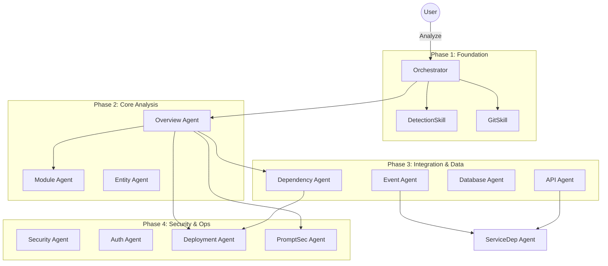
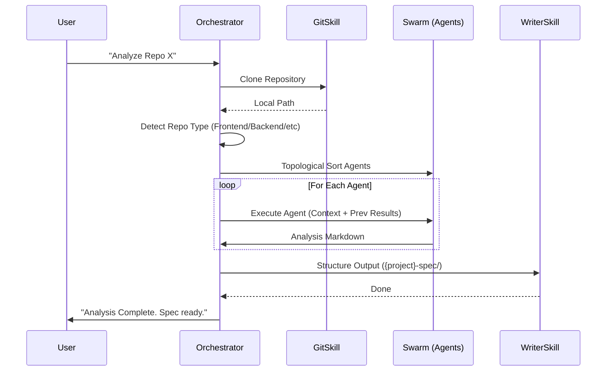

# Architecture & Design

**RepoSpecZero** acts as a bridge between raw code repositories and the **SPEC-OS** knowledge graph. It employs an agentic swarm pattern to decompose the complex task of "understanding a codebase" into granular, expert-level analysis tasks.

## 🧩 Agent Swarm Topology

The system is coordinated by a central **Orchestrator** which manages 17 specialized agents organized by domain. Dependencies (arrows) dictate the execution order.

## ⚡ Execution Flow

The analysis process follows a strict pipeline to ensure context is built progressively.

## 📂 Implementation Details

### 1. The Orchestrator (`RepoSpecZeroOrchestrator`)
*   **Role**: The primary intelligence.
*   **Method**: `process(context)`
*   **Logic**:
    1.  Receives `repoUrl` or `taskId`.
    2.  Clones the repo to a temporary workspace.
    3.  Runs `SpecZeroDetectionSkill` to identify the tech stack (e.g., "Next.js + Tailwind").
    4.  Builds a dependency graph of all 17 agents.
    5.  Executes them in topological order (e.g., `Overview` runs first, so `Deployment` can read the overview).
    6.  Aggregates outputs and writes files.

### 2. Specialized Agents
Each agent extends `RepoSpecZeroAgent` and focuses on one specific aspect.
*   **Prompts**: Loaded dynamically from `prompts/{type}/{agent}.md`.
*   **Context**: Can request outputs from previous agents (defined via `contextDeps`).
    *   *Example*: `DeploymentAgent` requests the output of `DependencyAgent` to understand what infrastructure libraries are used.

### 3. Skills
*   **`AnalyzeContextSkill`**: Wraps the LLM (Anthropic) calls with massive context window handling.
*   **`OutputWriterSkill`**: Enforces the rigid SPEC-OS directory structure.
*   **`BuildRepoTreeSkill`**: Generates a token-optimized representation of the file tree.

## 💾 Data Flow

1.  **Input**: Raw Code (`.git`)
2.  **Processing**: LLM Context Window (Code Tree + previous agent outputs)
3.  **Output**: Structured Markdown (`spec_zero.md`) -> SPEC-OS Graph
