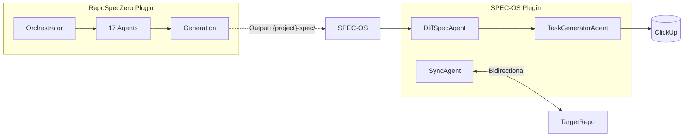

# Master Plan: Repo Spec Zero Transformation

## Goal
Create **`opencode-plugin-repo-spec-zero`**: An agentic plugin for **generating** SPEC-OS compatible specs.

> [!IMPORTANT]
> **Plugin Scope**: This plugin handles **generation only** (Phases 0-5).
> **SPEC-OS Scope**: TaskGenerator and SyncAgent belong to `opencode-plugin-spec-os`.

---

## Plugin Separation Architecture



| Responsibility | Plugin |
|----------------|--------|
| Analyze repo | **RepoSpecZero** |
| Generate spec-zero | **RepoSpecZero** |
| Detect diff | **SPEC-OS** (future) |
| Create tasks from diff | **SPEC-OS** (future) |
| Sync submodules | **SPEC-OS** (future) |

---

## Phase 0: Output Architecture

### 0.1 Submodule Structure (Modular)

```
{project}-spec/
├── README.md
├── spec_zero.md                   # Entry point
│
├── architecture/
│   └── architecture.md
│
├── analysis/
│   ├── core/                      # Domain: Core analysis
│   │   ├── overview.md
│   │   ├── module.md
│   │   └── entity.md
│   │
│   ├── data/                      # Domain: Data layer
│   │   ├── db.md
│   │   ├── data_map.md
│   │   └── event.md
│   │
│   ├── integration/               # Domain: External
│   │   ├── api.md
│   │   ├── dependency.md
│   │   └── service_dep.md
│   │
│   ├── security/                  # Domain: Security
│   │   ├── auth.md
│   │   ├── authz.md
│   │   ├── security.md
│   │   └── prompt_sec.md
│   │
│   └── ops/                       # Domain: Operations
│       ├── deployment.md
│       ├── monitor.md
│       ├── ml.md
│       └── flag.md
│
├── delta/
│   └── CHANGELOG.md
│
└── v1/                            # Versioned snapshots
    └── {date}_spec_zero.md        # Frozen version
```

### 0.2 Versioning Strategy (v1/)

| Event | Action |
|-------|--------|
| First generation | Create `v1/{date}_spec_zero.md` |
| Major update | Archive current to `v1/`, update `spec_zero.md` |
| Status → `prod` | Tag version, freeze in `v1/` |

---

## Phase 1-5: (In This Plugin)

### Phase 1: Foundation
- Scaffold plugin
- Port core modules (config, git-manager, analyzer)

### Phase 2: Task Management
- TaskSpecAgent (fetch/update ClickUp via Activity Register)

### Phase 3: Agent Swarm

| # | Agent | Prompt | Output File | Context |
|---|-------|--------|-------------|---------|
| 1 | `overview` | `hl_overview.md` | `core/overview.md` | - |
| 2 | `module` | `module_deep_dive.md` | `core/module.md` | `overview` |
| 3 | `entity` | `core_entities.md` | `core/entity.md` | - |
| 4 | `db` | `db.md` | `data/db.md` | - |
| 5 | `data_map` | `data_mapping.md` | `data/data_map.md` | - |
| 6 | `event` | `events.md` | `data/event.md` | - |
| 7 | `api` | `apis.md` | `integration/api.md` | - |
| 8 | `dependency` | `dependencies.md` | `integration/dependency.md` | `overview` |
| 9 | `service_dep` | `service_dependencies.md` | `integration/service_dep.md` | `overview`,`api`,`event` |
| 10 | `auth` | `authentication.md` | `security/auth.md` | - |
| 11 | `authz` | `authorization.md` | `security/authz.md` | - |
| 12 | `security` | `security_check.md` | `security/security.md` | - |
| 13 | `prompt_sec` | `prompt_security_check.md` | `security/prompt_sec.md` | `overview`,`ml` |
| 14 | `deployment` | `deployment.md` | `ops/deployment.md` | `overview`,`dependency` |
| 15 | `monitor` | `monitoring.md` | `ops/monitor.md` | - |
| 16 | `ml` | `ml_services.md` | `ops/ml.md` | `overview` |
| 17 | `flag` | `feature_flags.md` | `ops/flag.md` | `overview` |

### Phase 4: Orchestration
- Fetch task → Clone → Detect → Execute agents → Write output → Report

### Phase 5: Optimization
- Toast notifications
- Prompt tuning

---

## Future: SPEC-OS Integration (Docs Only)

> [!NOTE]
> These features will be implemented in `opencode-plugin-spec-os`, not here.

### DiffSpecAgent
Compares current spec vs desired changes.

### TaskGeneratorAgent
Creates ClickUp tasks from diff.

### SyncAgent
Keeps `.spec/` (target) and `domain_docs/` (SPEC-OS) aligned.

---

## Verification Plan
1. Build: `npm run build`
2. Detection: Known repo → correct type
3. Agent: Single agent output
4. Swarm: Full 17-agent flow
5. Output: Valid `spec_zero.md`
6. ClickUp: Task read/update
