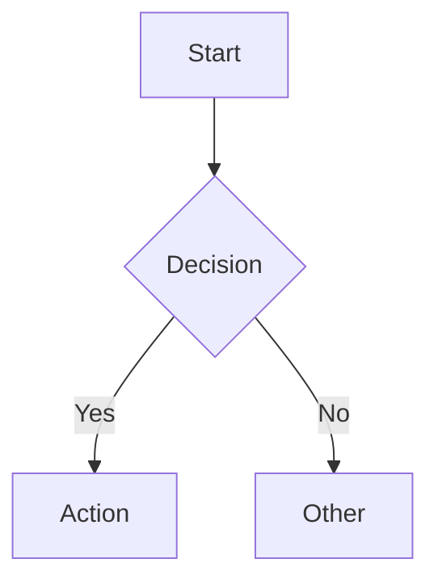
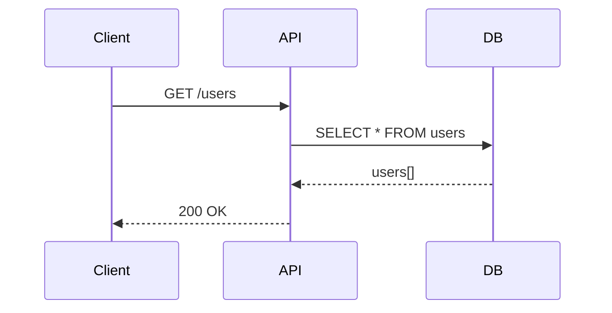

<!-- version=1 -->
# SPEC-OS Output Format v2.1.0

Every output MUST follow this exact structure to be SPEC-OS compliant.

## YAML Frontmatter (REQUIRED)

Every document MUST start with YAML frontmatter:

```yaml
---
uid: {project-slug}:spec:{section-name}
title: "{Section Title}"
status: draft
version: 1.0.0
created: {YYYY-MM-DD}
prompt_version: {prompt-id}@v{version}
edges:
  - [[{project-slug}:spec:{related}|{edge_type}]]
tags: [spec, {category}]
---
```

### Field Descriptions

| Field | Required | Description |
|-------|----------|-------------|
| `uid` | Yes | Unique identifier: `{project}:spec:{section}` |
| `title` | Yes | Human-readable title |
| `status` | Yes | One of: `draft`, `review`, `approved` |
| `version` | Yes | SemVer version of this spec |
| `created` | Yes | ISO date (YYYY-MM-DD) |
| `prompt_version` | Yes | Prompt used: `{id}@v{version}` |
| `edges` | No | Links to related specs |
| `tags` | No | Categorization tags |

## Section Structure

### Heading Hierarchy

- Use `##` (H2) for main sections
- Use `###` (H3) for subsections
- Use `####` (H4) sparingly, for details

### Standard Sections

Most spec documents should include:

1. **Overview** - Brief summary (2-3 sentences)
2. **Details** - Main content with specifics
3. **Diagram** - Visual representation (Mermaid)
4. **Related** - Links to related specs

## Code Blocks

Always specify the language:

```typescript
// TypeScript example
interface User {
  id: string;
  name: string;
}
```

```python
# Python example
def get_user(user_id: str) -> User:
    pass
```

## Tables

Use tables for structured data:

| Column 1 | Column 2 | Column 3 |
|----------|----------|----------|
| Data | Data | Data |

## Edge Syntax

Use Obsidian-safe link format for edges:

```
[[{project-slug}:spec:{target}|{edge_type}]]
```

### Edge Types

| Type | When to Use |
|------|-------------|
| `depends_on` | This requires another spec |
| `implements` | This implements a contract |
| `extends` | This extends another spec |
| `uses` | This calls/uses another |
| `contains` | This contains another |

## Mermaid Diagrams

Include diagrams inline in the document:



## Citation Rules

### DO
- Cite file paths: `src/handlers/user.ts:42`
- Be specific about locations
- Quote actual code when relevant

### DON'T
- Invent information not in the code
- Assume features exist without evidence
- Make up file paths or line numbers

### When Information is Missing

If requested information cannot be found, write:

```
**NOT_FOUND**: Could not locate {description} in the codebase.
```

## Complete Example

```markdown
---
uid: myapp:spec:api-users
title: "Users API"
status: draft
version: 1.0.0
created: 2026-01-16
prompt_version: api/detect-endpoints@v1
edges:
  - [[myapp:spec:entity-user|operates_on]]
  - [[myapp:spec:auth-jwt|requires]]
tags: [spec, api, users]
---

## Overview

The Users API provides CRUD operations for user management.

## Endpoints

| Method | Path | Handler | Auth |
|--------|------|---------|------|
| GET | /api/users | `getUsers` | Yes |
| POST | /api/users | `createUser` | Yes |

Source: `src/routes/users.ts:12-45`

## Diagram



## Related

- [[myapp:spec:entity-user|operates_on]]
```
