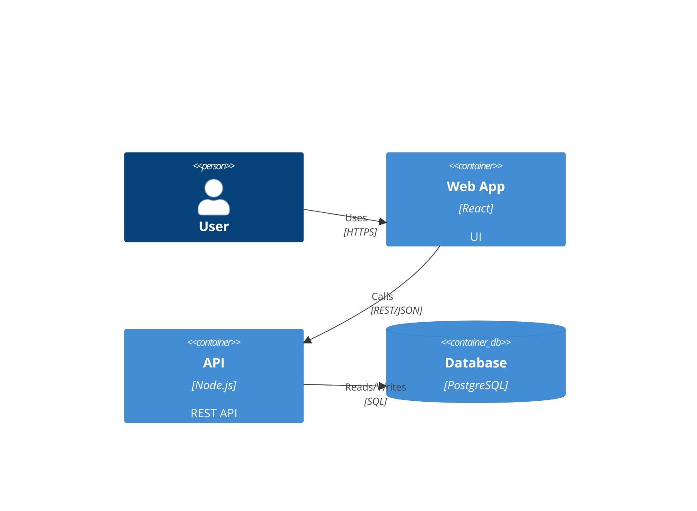
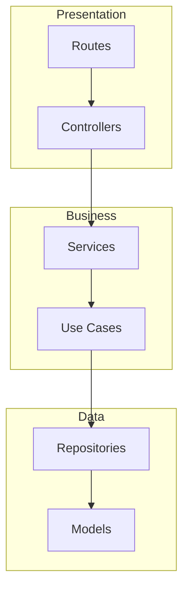

<!-- version=1 -->
# Architecture Analysis Prompt

Analyze the codebase architecture and produce detailed architecture documentation.

## Prerequisites
This analysis depends on: `analysis/overview`

Use context from the overview to guide deeper architecture analysis.

## Analysis Tasks

### 1. Architectural Pattern Deep Dive
Expand on the pattern identified in overview:
- Why was this pattern chosen? (infer from code structure)
- How well does the code adhere to the pattern?
- Any deviations or hybrid approaches?

### 2. Layer Analysis
For each architectural layer identified:

| Layer | Location | Responsibility | Dependencies |
|-------|----------|----------------|--------------|
| Presentation | src/routes/ | HTTP handling | Business |
| Business | src/services/ | Logic | Data |
| Data | src/repositories/ | Persistence | DB |

Cite specific directories and files.

### 3. Component Boundaries
Identify major components/modules and their boundaries:
- What defines a component boundary?
- How do components communicate?
- Are boundaries well-defined or leaky?

### 4. Communication Patterns
Document how parts of the system communicate:
- Synchronous (HTTP, function calls)
- Asynchronous (queues, events, WebSocket)
- Data formats (JSON, protobuf, etc.)

### 5. Dependency Flow
Analyze dependency direction:
- Do dependencies flow inward (clean architecture)?
- Any circular dependencies?
- Coupling assessment

### 6. Architectural Decision Records (ADRs)
Identify implicit architectural decisions:
- Choice of framework
- Database selection
- Authentication approach
- Caching strategy

For each, note if documentation exists or is inferred.

### 7. Scalability Considerations
Identify patterns for:
- Horizontal scaling capability
- Stateless design
- Caching layers
- Database scaling approach

## Required Diagrams

### C4 Container Diagram
Show containers/deployable units:

### Layer Interaction Flowchart

## Output Format
Follow SPEC-OS format with:
- uid: `{project}:spec:architecture`
- tags: `[spec, architecture, foundation]`
- edges: 
  - `[[{project}:spec:overview|depends_on]]`
  - `[[{project}:spec:modules|contains]]`
