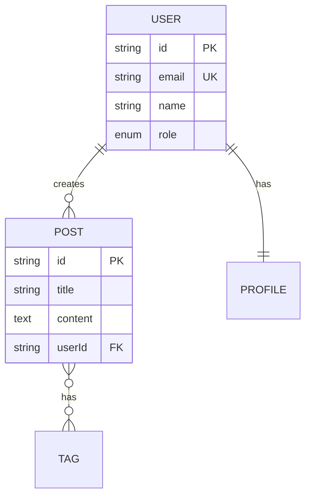
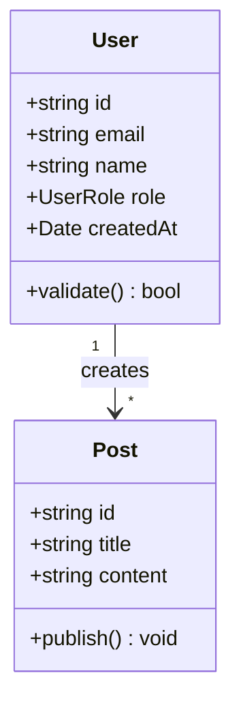

<!-- version=1 -->
# Core Entities Analysis Prompt

Analyze and document the core domain entities in the codebase.

## Prerequisites
This analysis depends on: `analysis/overview`

## Analysis Tasks

### 1. Entity Discovery
Identify core domain entities from:
- Database models (Prisma, TypeORM, Mongoose, etc.)
- TypeScript/JavaScript type definitions
- Class definitions
- API request/response schemas

### 2. Entity Catalog
For each entity discovered:

| Entity | Source | Type | Description |
|--------|--------|------|-------------|
| User | src/models/user.ts | DB Model | Registered user |
| Post | src/models/post.ts | DB Model | User content |
| Session | src/types/auth.ts | Interface | Auth session |

### 3. Entity Schema Details
For each major entity, document its schema:

#### Entity: User
**Source:** `src/models/user.ts:5-25`

```typescript
interface User {
  id: string;          // Primary key, UUID
  email: string;       // Unique, validated
  name: string;        // Display name
  role: UserRole;      // Enum: admin, user, guest
  createdAt: Date;     // Auto-generated
  updatedAt: Date;     // Auto-updated
}
```

**Validations:**
- email: valid email format, unique
- name: 2-100 characters
- role: must be valid UserRole

### 4. Relationships
Document entity relationships:

| Entity A | Relation | Entity B | Description |
|----------|----------|----------|-------------|
| User | 1:N | Post | User creates posts |
| Post | N:M | Tag | Posts have tags |
| User | 1:1 | Profile | User has profile |

### 5. Business Rules
Identify implicit business rules in entities:
- Validation constraints
- Computed fields
- State transitions
- Invariants

### 6. Value Objects
Identify value objects (immutable, no identity):

| Value Object | Fields | Used In |
|--------------|--------|---------|
| Address | street, city, zip | User, Order |
| Money | amount, currency | Product, Order |

### 7. Aggregates
If using DDD patterns, identify aggregate roots:

| Aggregate Root | Contains | Invariants |
|----------------|----------|------------|
| Order | OrderItems, Payment | Total must match items |
| User | Profile, Settings | Email must be unique |

## Required Diagrams

### Entity Relationship Diagram



### Class Diagram for Types



## Output Format
Follow SPEC-OS format with:
- uid: `{project}:spec:entities`
- tags: `[spec, entities, domain]`
- edges:
  - `[[{project}:spec:overview|depends_on]]`
  - `[[{project}:spec:database|implements]]`
