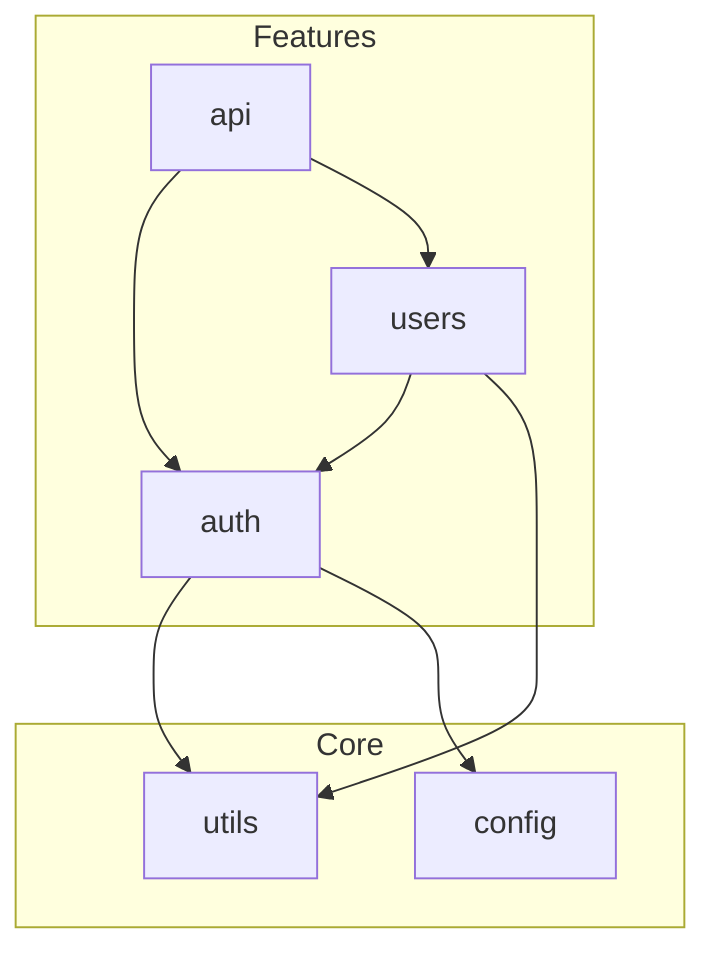

<!-- version=1 -->
# Modules Analysis Prompt

Analyze the codebase module structure and dependencies.

## Prerequisites
This analysis depends on: `analysis/architecture`

## Analysis Tasks

### 1. Module Identification
For each major module/package in the codebase:

| Module | Path | Type | Description |
|--------|------|------|-------------|
| | src/modules/auth | Feature | Authentication logic |
| | src/lib/utils | Shared | Utility functions |

### 2. Module Responsibilities
For each module, document:
- **Single Responsibility**: What is this module's primary purpose?
- **Public API**: What does it export?
- **Internal Structure**: How is it organized internally?

### 3. Dependency Analysis
Create a dependency matrix:

| Module | Depends On | Used By |
|--------|------------|---------|
| auth | db, crypto | api, users |
| users | auth, db | api |

### 4. Dependency Graph
Document the inter-module dependency flow:
- Which modules are foundational (no dependencies)?
- Which modules are highly coupled?
- Any circular dependencies detected?

### 5. Module Health Assessment
For each module, assess:

| Module | Cohesion | Coupling | Complexity | Health |
|--------|----------|----------|------------|--------|
| auth | High | Medium | Low | Good |
| legacy | Low | High | High | Poor |

Criteria:
- **Cohesion**: Do all parts serve the same purpose?
- **Coupling**: How many external dependencies?
- **Complexity**: Lines of code, cyclomatic complexity hints

### 6. Key Exports
For each module, list main exports:

```typescript
// src/modules/auth/index.ts
export { authenticate } from './authenticate';
export { authorize } from './authorize';
export type { User, Session } from './types';
```

### 7. Module Boundaries
Identify how module boundaries are enforced:
- Index files for public API
- Internal folders/conventions
- Barrel exports
- Path aliases

## Required Diagrams

### Module Dependency Flowchart



## Output Format
Follow SPEC-OS format with:
- uid: `{project}:spec:modules`
- tags: `[spec, modules, structure]`
- edges:
  - `[[{project}:spec:architecture|depends_on]]`
  - `[[{project}:spec:dependencies|uses]]`
