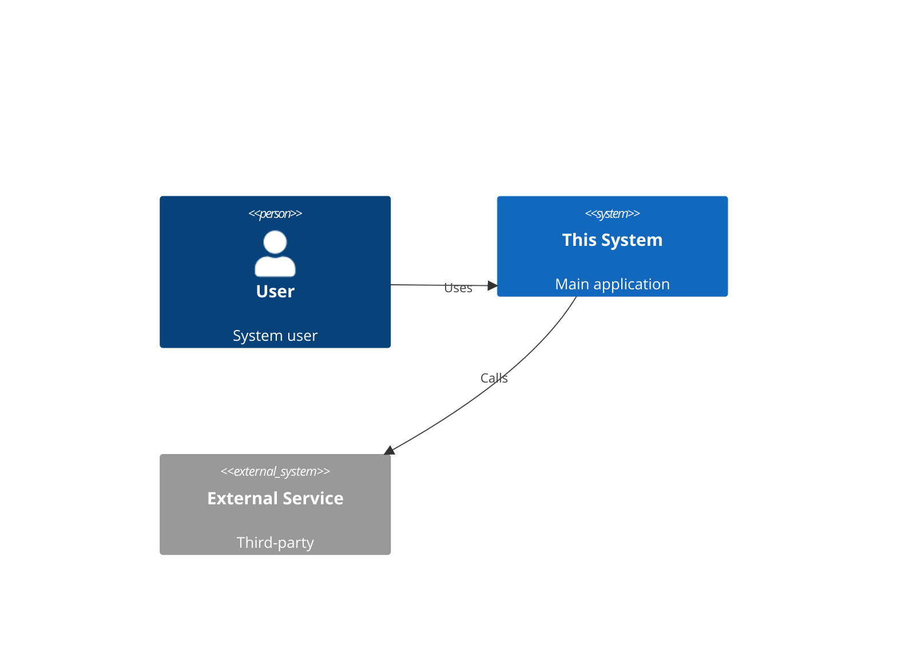
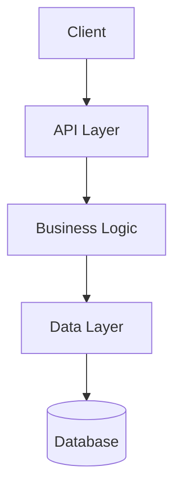

<!-- version=1 -->
# Overview Analysis Prompt

Analyze this repository and produce a comprehensive overview document.

## Analysis Tasks

### 1. Executive Summary
Write a 2-3 sentence summary of what this project does and its primary purpose.

### 2. Repository Identification
Determine and document:
- **Project Name**: Extract from package.json, Cargo.toml, or similar
- **Version**: Current version if available
- **Repository Type**: backend | frontend | fullstack | library | mobile | monorepo | cli
- **Primary Language**: Main programming language used

### 3. Technology Stack
Create a table of technologies used:

| Category | Technology | Version | Purpose |
|----------|------------|---------|---------|
| Runtime | | | |
| Framework | | | |
| Database | | | |
| Testing | | | |

Source each finding with file path: `package.json:15`

### 4. Architecture Pattern
Identify the primary architectural pattern:
- Layered / N-tier
- MVC / MVVM
- Microservices
- Serverless
- Monolith
- Event-driven
- Other (specify)

Provide evidence from code structure.

### 5. Directory Structure
Document the top-level directory structure with descriptions:

```
/
├── src/           # Description
├── tests/         # Description
└── ...
```

### 6. Entry Points
Identify main entry points:
- Build entry: (e.g., src/index.ts)
- Server entry: (e.g., src/server.ts)
- CLI entry: (e.g., src/cli.ts)

### 7. Build & Run Commands
Document available commands from package.json scripts or similar:

| Command | Purpose |
|---------|---------|
| `npm run dev` | Development server |
| `npm run build` | Production build |
| `npm test` | Run tests |

## Required Diagrams

### C4 Context Diagram
Show the system in context with users and external systems:



### High-Level Architecture Flowchart
Show main components and data flow:



## Output Format
Follow SPEC-OS format with:
- uid: `{project}:spec:overview`
- tags: `[spec, overview, foundation]`
- edges: link to architecture.md when created
