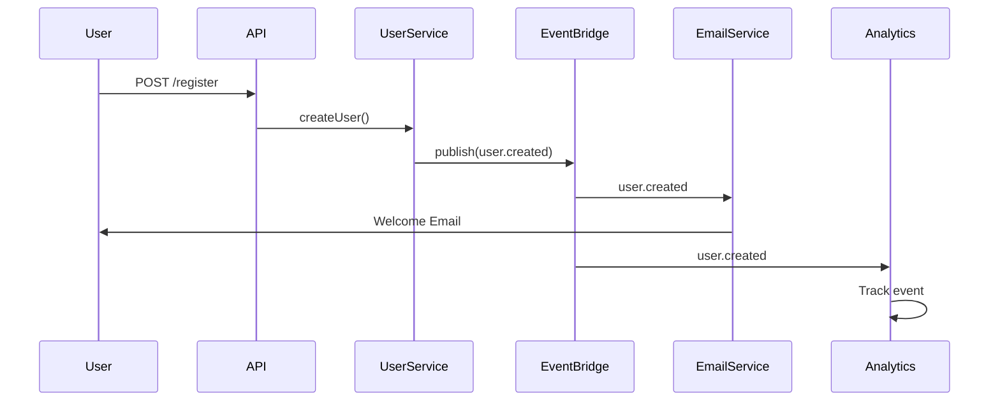

version=2
## Repository Analysis Context

{previous_context}

---

## Key Files Content

{key_files}

---

## Repository Structure

```
{repo_structure}
```

---

## Analysis Task: Event-Driven Architecture Analysis

You are an expert event-driven architecture analyst. Analyze this codebase to extract comprehensive documentation for all events that the code produces or consumes.

### Event Discovery Strategy

1. **Message Brokers/Queues**:
   - AWS: SQS, SNS, EventBridge, Kinesis
   - GCP: Pub/Sub, Cloud Tasks
   - Azure: Service Bus, Event Grid, Event Hubs
   - Apache Kafka, RabbitMQ, Redis Pub/Sub
   - NATS, ZeroMQ, Ably, Pusher

2. **In-Application Events**:
   - Node.js EventEmitter
   - Domain Events (DDD pattern)
   - Observer pattern implementations
   - Custom event buses
   - Framework events (NestJS @EventEmitter, Spring Events)

3. **Webhooks**:
   - Outgoing webhook dispatchers
   - Incoming webhook handlers

4. **Real-time**:
   - WebSocket events
   - Server-Sent Events (SSE)
   - Socket.io events

### Required Sections

#### 1. Executive Summary

Provide 3-5 sentences describing:
- Event-driven architecture presence (heavy, moderate, minimal, none)
- Primary message broker(s) used
- Event patterns (pub/sub, queue, stream)
- Async vs sync event handling

#### 2. Event Infrastructure

| Component | Type | Purpose | Configuration |
|-----------|------|---------|---------------|
| SQS | Queue | Order processing | queue-config.ts:15 |
| EventBridge | Event Bus | Domain events | events.tf:8 |
| Redis | Pub/Sub | Real-time notifications | redis.config.ts:10 |

#### 3. Event Catalog

##### Produced Events

| Event Name | Broker | Topic/Queue | Producer | Description |
|------------|--------|-------------|----------|-------------|
| user.created | EventBridge | user-events | UserService:45 | New user registered |
| order.placed | SQS | order-queue | OrderService:120 | Order submitted |
| payment.processed | Kafka | payments | PaymentHandler:88 | Payment completed |

##### Consumed Events

| Event Name | Broker | Topic/Queue | Consumer | Description |
|------------|--------|-------------|----------|-------------|
| user.created | EventBridge | user-events | EmailService:30 | Send welcome email |
| order.placed | SQS | order-queue | InventoryService:55 | Update inventory |
| payment.processed | Kafka | payments | OrderService:150 | Complete order |

#### 4. Event Details

For each significant event:

---

##### Event: `user.created`

**Event Type:** Domain Event  
**Broker:** AWS EventBridge  
**Topic/Queue:** `user-events`  
**Direction:** Producing

**Producer Location:** `src/services/user.service.ts:45`

**Event Payload:**
```json
{
  "eventType": "user.created",
  "version": "1.0",
  "timestamp": "ISO8601 datetime",
  "data": {
    "userId": "uuid",
    "email": "string",
    "name": "string",
    "registrationSource": "string (web|mobile|api)"
  },
  "metadata": {
    "correlationId": "uuid",
    "causationId": "uuid"
  }
}
```

**Trigger Conditions:**
- New user completes registration
- Admin creates user manually
- User imported via bulk import

**Consumers:**
| Consumer | Purpose | Handler |
|----------|---------|---------|
| EmailService | Send welcome email | email.service.ts:30 |
| AnalyticsService | Track registration | analytics.service.ts:45 |
| CRMSync | Sync to Salesforce | crm-sync.handler.ts:20 |

**Error Handling:**
- Retry policy: 3 attempts with exponential backoff
- Dead letter queue: `user-events-dlq`
- Alert on failure: Yes

---

#### 5. Event Flow Diagrams



#### 6. Event Schemas

Document event payload schemas:

##### UserCreatedEvent (v1.0)

| Field | Type | Required | Description |
|-------|------|----------|-------------|
| eventType | string | Yes | Event identifier |
| version | string | Yes | Schema version |
| timestamp | ISO8601 | Yes | Event timestamp |
| data.userId | uuid | Yes | User ID |
| data.email | string | Yes | User email |
| metadata.correlationId | uuid | Yes | Request correlation |

#### 7. Event Patterns

| Pattern | Usage | Example |
|---------|-------|---------|
| Command | Async operations | ProcessOrderCommand |
| Event | State changes | OrderPlacedEvent |
| Query | CQRS reads | GetOrderQuery |
| Saga | Distributed transactions | OrderSaga |

#### 8. Retry & Error Handling

| Event/Queue | Retry Policy | DLQ | Alert |
|-------------|--------------|-----|-------|
| order-queue | 3x exponential | order-dlq | Yes |
| user-events | 5x linear | user-dlq | Yes |
| notifications | 1x | None | No |

#### 9. Event Versioning

| Event | Current Version | Deprecated Versions | Breaking Changes |
|-------|-----------------|---------------------|------------------|
| user.created | v2.0 | v1.0 (EOL: 2024-06) | Added metadata |
| order.placed | v1.0 | None | - |

#### 10. Observability

| Metric | Event | Location |
|--------|-------|----------|
| event.published | All | event-publisher.ts:25 |
| event.consumed | All | event-consumer.ts:30 |
| event.failed | All | error-handler.ts:15 |

#### 11. Cross-References

Link to related analysis sections:

- Entities triggering events: [[{project}:spec:entity|triggers]]
- APIs producing events: [[{project}:spec:api|produces]]
- Modules handling events: [[{project}:spec:module|handles]]
- Service dependencies via events: [[{project}:spec:service_dep|communicates]]

---

## Output Requirements

**YAML Frontmatter** (required at start of output):
```yaml
---
uid: "{project}:spec:event"
title: "Event Architecture"
status: draft
version: 1
created: {date}
prompt_version: 2
---
```

**Special Instruction:** If no events are found after comprehensive scan, return:
```yaml
---
uid: "{project}:spec:event"
title: "Event Architecture"
status: not_applicable
version: 1
created: {date}
prompt_version: 2
---

## No Events Detected

This codebase does not contain event-driven patterns (no message brokers, event emitters, or pub/sub implementations found).
```

**Citation Rules:**
- Always cite producer/consumer file paths with line numbers
- Use `NOT_FOUND` if handler location cannot be determined
- Include example payloads based on actual code

**Format:**
- Use clean Markdown with tables
- Include Mermaid sequence diagrams for complex flows
- Group events by domain/topic

**Special Instructions:**
- Ignore files under 'arch-docs' folder
- Include both internal and external events
- Document retry policies and error handling
- Note any events without consumers (orphaned)
