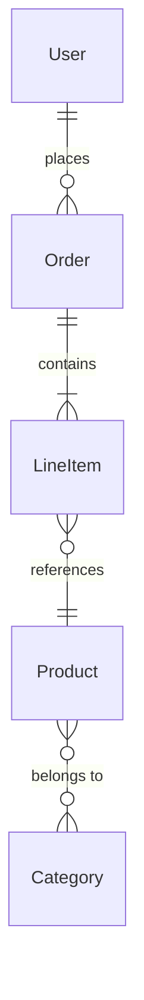

version=2
## Repository Analysis Context

{previous_context}

---

## Key Files Content

{key_files}

---

## Repository Structure

```
{repo_structure}
```

---

## Analysis Task: Core Domain Entities

Act as a senior software architect and domain modeling expert. Your task is to identify, document, and analyze the core domain entities (data models, business objects, value objects) that form the foundation of this project's domain.

### Discovery Strategy

1. **Primary Sources** (check in order):
   - Database schemas: Prisma schema, TypeORM entities, Mongoose models, SQL migrations
   - Type definitions: TypeScript interfaces/types, Python dataclasses, Go structs
   - API contracts: OpenAPI/Swagger definitions, GraphQL schemas, Protobuf definitions
   - ORM models: ActiveRecord, Sequelize, Django models, SQLAlchemy
   - Domain layer: DDD entities, aggregates, value objects

2. **Secondary Sources**:
   - DTOs (Data Transfer Objects)
   - Request/Response types
   - State management types (Redux, Zustand, etc.)
   - Configuration objects

### Required Sections

#### 1. Executive Summary

Provide 3-5 sentences describing:
- The domain this project models
- Key business concepts represented
- Complexity level (simple CRUD, rich domain, event-sourced)

#### 2. Entity Catalog

For each core entity, provide:

| Entity | Type | Location | Description |
|--------|------|----------|-------------|
| User | DB Model | src/models/user.ts:15 | Represents a system user with authentication |
| Order | Aggregate | src/domain/order.ts:8 | Order aggregate root with line items |
| ... | ... | ... | ... |

**Entity Types:**
- `DB Model` - Database/ORM entity
- `Aggregate` - DDD aggregate root
- `Value Object` - Immutable value type
- `DTO` - Data transfer object
- `Event` - Domain event
- `Enum` - Enumeration type

#### 3. Entity Details

For each significant entity, document:

##### [Entity Name]

**Definition Location:** `path/to/file.ts:line`

**Attributes:**

| Field | Type | Required | Description |
|-------|------|----------|-------------|
| id | string/UUID | Yes | Unique identifier |
| name | string | Yes | Display name |
| status | enum | Yes | Current status (active/inactive) |
| createdAt | DateTime | Yes | Creation timestamp |
| ... | ... | ... | ... |

**Validation Rules:**
- List any validation constraints (min/max length, patterns, ranges)

**Business Invariants:**
- List any business rules this entity enforces

#### 4. Entity Relationships

Document relationships between entities:

| From Entity | Relationship | To Entity | Cardinality | Description |
|-------------|--------------|-----------|-------------|-------------|
| User | has many | Order | 1:N | User can place multiple orders |
| Order | belongs to | User | N:1 | Each order belongs to one user |
| Order | has many | LineItem | 1:N | Order contains line items |
| Product | many to many | Category | M:N | Products can be in multiple categories |

**Relationship Types:**
- `has one` (1:1)
- `has many` (1:N)
- `belongs to` (N:1)
- `many to many` (M:N)
- `references` (loose coupling)
- `embeds` (embedded document/value object)

#### 5. Entity Relationship Diagram

Provide an ASCII or Mermaid diagram:



#### 6. Inheritance & Composition

Document any inheritance hierarchies or composition patterns:

| Base/Parent | Derived/Child | Pattern | Description |
|-------------|---------------|---------|-------------|
| BaseEntity | User, Order | Inheritance | Common ID and timestamps |
| Auditable | all entities | Mixin | CreatedAt, UpdatedAt tracking |
| Address | User.address | Composition | Embedded value object |

#### 7. Domain Events (if applicable)

If the system uses domain events:

| Event | Trigger Entity | Payload | Description |
|-------|----------------|---------|-------------|
| UserCreated | User | {userId, email} | Emitted when user registers |
| OrderPlaced | Order | {orderId, items} | Emitted when order is submitted |

#### 8. Data Lifecycle

For critical entities, document:

| Entity | Creation | Updates | Deletion | Archival |
|--------|----------|---------|----------|----------|
| User | Registration API | Profile updates | Soft delete | After 7 years |
| Order | Checkout flow | Status changes | Never | After 5 years |

#### 9. Cross-References

Link to related analysis sections:

- API endpoints that expose these entities: [[{project}:spec:api|exposes]]
- Database tables backing these entities: [[{project}:spec:db|persists]]
- Events emitted by these entities: [[{project}:spec:event|emits]]
- Modules that define these entities: [[{project}:spec:module|defines]]

---

## Output Requirements

**YAML Frontmatter** (required at start of output):
```yaml
---
uid: "{project}:spec:entity"
title: "Core Domain Entities"
status: draft
version: 1
created: {date}
prompt_version: 2
---
```

**Citation Rules:**
- Always cite file paths with line numbers: `src/models/user.ts:15`
- Use `NOT_FOUND` if entity source cannot be located
- Mark inferred information with `[inferred]`

**Format:**
- Use clean Markdown with tables
- Include Mermaid diagram if relationships are complex
- Group related entities together

**Special Instructions:**
- Ignore files under 'arch-docs' or similar documentation folders
- Focus on production entities, not test fixtures
- Prioritize entities with database persistence over DTOs
