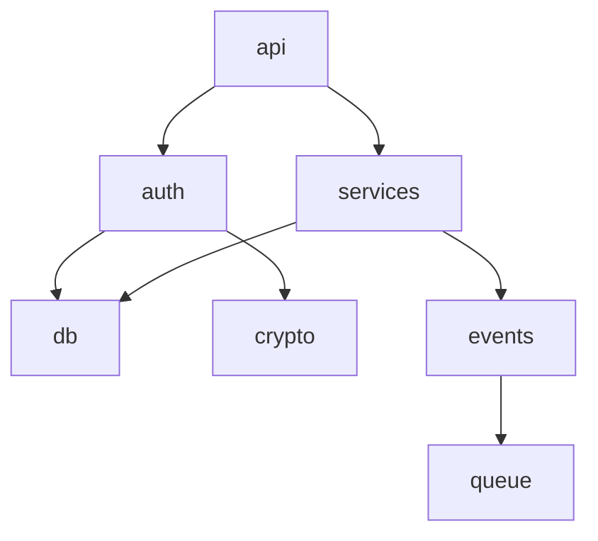

version=2
## Repository Analysis Context

{previous_context}

---

## Key Files Content

{key_files}

---

## Repository Structure

```
{repo_structure}
```

---

## Analysis Task: Module Deep Dive

Act as a senior software architect performing detailed module analysis. Based on the high-level overview provided in the context, perform a deep dive into each significant module/component of this codebase.

### Module Discovery

Identify modules from:
1. **Top-level directories**: `src/`, `lib/`, `packages/`, `apps/`, `services/`
2. **Framework conventions**: Controllers, Services, Repositories, Models
3. **Domain boundaries**: Feature folders, bounded contexts
4. **Package structure**: Monorepo packages, Go packages, Python packages

### Required Sections

#### 1. Executive Summary

Provide 3-5 sentences describing:
- Total number of significant modules identified
- Primary architectural pattern (layered, hexagonal, feature-based)
- Module coupling assessment (loose, moderate, tight)

#### 2. Module Inventory

| Module | Path | Type | Lines | Dependencies | Description |
|--------|------|------|-------|--------------|-------------|
| auth | src/modules/auth/ | Feature | ~500 | db, crypto | Authentication module |
| api | src/api/ | Layer | ~1200 | auth, services | REST API layer |
| ... | ... | ... | ... | ... | ... |

**Module Types:**
- `Feature` - Business feature/domain module
- `Layer` - Architectural layer (controllers, services, repos)
- `Shared` - Shared utilities/common code
- `Infrastructure` - External service integrations
- `Core` - Core domain logic

#### 3. Module Details

For each significant module:

---

##### Module: [Name]

**Location:** `path/to/module/`

**Core Responsibility:**
Brief description (2-3 sentences) of what this module does and why it exists.

**Key Components:**

| Component | Type | File | Description |
|-----------|------|------|-------------|
| UserService | Service | user.service.ts:10 | Handles user CRUD operations |
| AuthGuard | Middleware | auth.guard.ts:5 | JWT validation guard |
| UserController | Controller | user.controller.ts:8 | REST endpoints for users |
| ... | ... | ... | ... |

**Internal Dependencies:**
- `@src/db` - Database connection and queries
- `@src/utils/crypto` - Password hashing utilities
- `@src/config` - Configuration access

**External Dependencies:**
- `jsonwebtoken` - JWT token handling
- `bcrypt` - Password hashing

**Exposed Interfaces:**

```typescript
// Key exports from this module
export interface UserService {
  findById(id: string): Promise<User>;
  create(data: CreateUserDto): Promise<User>;
  // ...
}
```

**Configuration:**
- Environment variables used
- Config files consumed
- Feature flags checked

---

#### 4. Module Dependency Graph

Provide a visual representation of module dependencies:



**Dependency Analysis:**

| Module | Depends On | Depended By | Coupling |
|--------|------------|-------------|----------|
| auth | db, crypto | api, services | Low |
| db | config | auth, services, events | Medium |
| api | auth, services | none | Low |

#### 5. Module Boundaries

Analyze how well-defined module boundaries are:

| Module | Boundary Type | Violations | Assessment |
|--------|---------------|------------|------------|
| auth | Interface-based | 0 | Clean |
| services | Directory-based | 2 | Minor leaks |
| utils | None | 5 | Needs refactor |

**Boundary Types:**
- `Interface-based` - Exports through defined interfaces
- `Directory-based` - Uses index.ts barrel exports
- `Package-based` - Separate npm/go packages
- `None` - No clear boundary

#### 6. Shared Code Analysis

Identify shared/common code:

| Shared Module | Used By | Purpose |
|---------------|---------|---------|
| @src/utils | 8 modules | Common utilities |
| @src/types | All modules | Shared type definitions |
| @src/errors | 5 modules | Error classes |

#### 7. Circular Dependencies

Identify any circular dependency issues:

| Cycle | Impact | Suggested Fix |
|-------|--------|---------------|
| auth -> user -> auth | High | Extract shared types to common |
| None found | - | - |

#### 8. Module Health Assessment

| Module | Cohesion | Coupling | Size | Complexity | Health |
|--------|----------|----------|------|------------|--------|
| auth | High | Low | Medium | Low | Good |
| services | Medium | Medium | Large | High | Review |
| utils | Low | Low | Small | Low | Refactor |

**Health Ratings:**
- `Good` - Well-structured, maintainable
- `Review` - Some concerns, monitor
- `Refactor` - Needs improvement
- `Critical` - Immediate attention required

#### 9. Cross-References

Link to related analysis sections:

- Entities defined in modules: [[{project}:spec:entity|defines]]
- APIs exposed by modules: [[{project}:spec:api|exposes]]
- Events produced/consumed: [[{project}:spec:event|handles]]
- Dependencies used: [[{project}:spec:dependency|uses]]

---

## Output Requirements

**YAML Frontmatter** (required at start of output):
```yaml
---
uid: "{project}:spec:module"
title: "Module Deep Dive"
status: draft
version: 1
created: {date}
prompt_version: 2
---
```

**Citation Rules:**
- Always cite file paths with line numbers: `src/modules/auth/index.ts:1`
- Use `NOT_FOUND` if module source cannot be located
- Use `~` for approximate line counts

**Format:**
- Use clean Markdown with tables
- Include Mermaid dependency graph
- Group related modules together

**Special Instructions:**
- Ignore files under 'arch-docs' or similar documentation folders
- Focus on production code, not test files
- Prioritize modules with business logic over utility modules
- Note any modules that seem oversized or undersized
