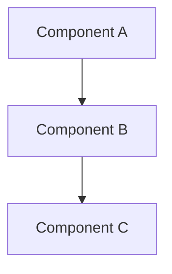

version=1
# Output Schema - SPEC-OS Format

## YAML Frontmatter (Required)

Every output MUST begin with YAML frontmatter:

```yaml
---
uid: {project-slug}:spec:{section-name}
title: "{Section Title}"
status: draft
version: 1.0.0
created: {YYYY-MM-DD}
prompt_version: {prompt-id}@v{version}
edges:
  - [[{project-slug}:spec:{related-section}|depends_on]]
tags:
  - spec
  - {section-name}
---
```

## Content Structure

### Heading Levels
- **H1 (#)**: Reserved for title in frontmatter
- **H2 (##)**: Main sections
- **H3 (###)**: Subsections
- **H4 (####)**: Detail levels

### Tables
Use for structured data:

```markdown
| Column 1 | Column 2 | Column 3 |
|----------|----------|----------|
| Data 1   | Data 2   | Data 3   |
```

### Code Blocks
Include language identifier:

```typescript
// Use language tags for syntax highlighting
function example() {}
```

### Diagrams
Use Mermaid for architecture diagrams:



## Edge Syntax

Link to other sections using Obsidian-safe format:

```
[[project-slug:spec:section-name|edge_type]]
```

### Valid Edge Types
- `depends_on` - This analysis depends on another section
- `implements` - Implements a specification or interface
- `extends` - Extends another component
- `uses` - Uses functionality from another component
- `contains` - Contains sub-components

## Citation Rules

### File References
Always cite file paths with line numbers:
- Single line: `src/server.ts:42`
- Range: `src/server.ts:10-25`
- Function: `src/server.ts:handleRequest`

### Code Snippets
Quote actual code when relevant:

> Found in `src/auth.ts:15`:
> ```typescript
> export function authenticate(token: string) { ... }
> ```

### Not Found
If information is unavailable:
- Write: **NOT_FOUND**
- Explain what was searched: "No authentication middleware found in `/src/middleware/`"

## Quality Checklist

Before outputting, verify:
- [ ] YAML frontmatter is present and valid
- [ ] All claims are cited with file paths
- [ ] Tables are properly formatted
- [ ] Code blocks have language tags
- [ ] NOT_FOUND is used for missing data (not invented)
- [ ] Edges link to related sections
