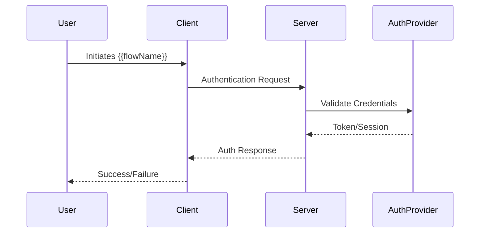

# {{flowName}}

> {{description}}

## Overview

| Property | Value |
|----------|-------|
| **Flow Type** | {{flowType}} |
| **Providers** | {{#each providers}}{{this}}{{#unless @last}}, {{/unless}}{{/each}} |
| **Token Type** | {{tokenType}} |

{{#if steps}}
## Flow Steps

{{#each steps}}
### Step {{@index}}: {{title}}

{{description}}

{{#if code}}
```{{language}}
{{code}}
```
{{/if}}

{{#if endpoint}}
**Endpoint:** `{{endpoint}}`
{{/if}}

{{/each}}
{{/if}}

## Sequence Diagram



{{#if tokens}}
## Tokens

| Token | Type | Expiry | Storage |
|-------|------|--------|---------|
{{#each tokens}}
| {{name}} | {{type}} | {{expiry}} | {{storage}} |
{{/each}}
{{/if}}

{{#if securityConsiderations}}
## Security Considerations

{{#each securityConsiderations}}
- **{{title}}**: {{description}}
{{/each}}
{{/if}}

## Implementation

| File | Purpose |
|------|---------|
{{#each implementations}}
| `{{file}}` | {{purpose}} |
{{/each}}

## Related

{{#each related}}
- [[{{uid}}|{{type}}]] - {{title}}
{{/each}}
