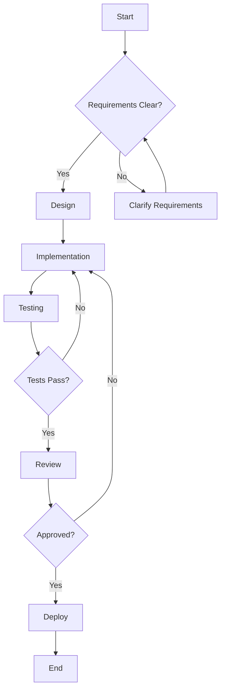

# {{featureName}}

> {{description}}

## Overview

| Property | Value |
|----------|-------|
| **Feature** | {{featureName}} |
| **Status** | {{status}} |
| **Priority** | {{priority}} |
| **Estimated Effort** | {{effort}} |

{{#if userStories}}
## User Stories

{{#each userStories}}
### US-{{@index}}: {{title}}

**As a** {{actor}}
**I want to** {{action}}
**So that** {{benefit}}

{{#if notes}}
> {{notes}}
{{/if}}

{{/each}}
{{/if}}

{{#if acceptanceCriteria}}
## Acceptance Criteria

{{#each acceptanceCriteria}}
- [ ] **AC-{{@index}}**: {{description}}
{{/each}}
{{/if}}

{{#if technicalRequirements}}
## Technical Requirements

### Backend

{{#each technicalRequirements.backend}}
- {{this}}
{{/each}}

### Frontend

{{#each technicalRequirements.frontend}}
- {{this}}
{{/each}}

### Database

{{#each technicalRequirements.database}}
- {{this}}
{{/each}}
{{/if}}

{{#if dependencies}}
## Dependencies

| Dependency | Type | Status |
|------------|------|--------|
{{#each dependencies}}
| {{name}} | {{type}} | {{status}} |
{{/each}}
{{/if}}

## Implementation Plan

## API Changes

{{#if apiChanges}}
{{#each apiChanges}}
### {{method}} {{path}}

{{description}}

{{/each}}
{{else}}
No API changes required.
{{/if}}

## Database Changes

{{#if dbChanges}}
{{#each dbChanges}}
- **{{type}}**: {{description}}
{{/each}}
{{else}}
No database changes required.
{{/if}}

## Testing Strategy

| Test Type | Coverage | Notes |
|-----------|----------|-------|
{{#each testStrategy}}
| {{type}} | {{coverage}} | {{notes}} |
{{/each}}

## Rollout Plan

{{rolloutPlan}}

## Related

{{#each related}}
- [[{{uid}}|{{type}}]] - {{title}}
{{/each}}
