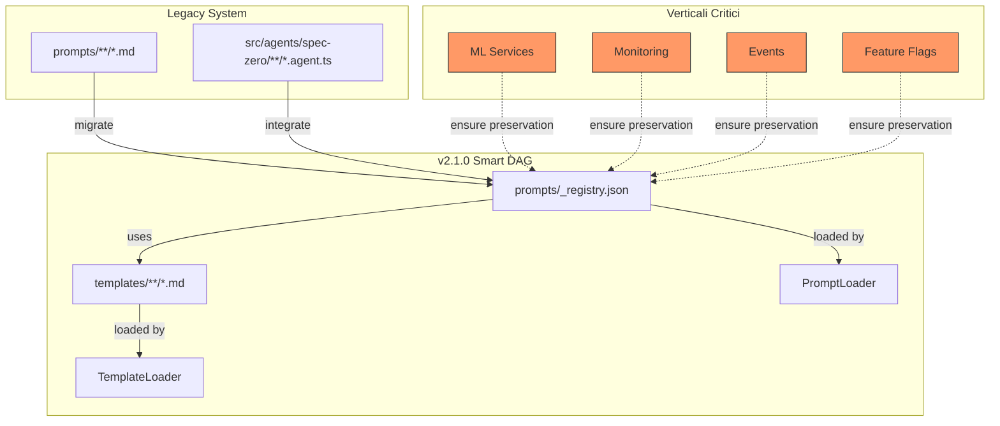

# Feature: Migrazione Prompt Registry Legacy → v2.1.0 (Smart DAG)

## Overview
Migrazione completa del sistema di prompt legacy alla v2.1.0 con Smart DAG, assicurando che tutti i verticali critici (ML, Monitor, Event, Flag) siano correttamente mappati e integrati nel nuovo sistema di registry con template e dependency tracking.

## Requirements

### REQ-001: Mappatura Completa Prompt Legacy
**Priority**: P0 (Critical)  
Tutti i prompt esistenti in `prompts/` devono essere mappati agli ID della v2.1.0 definiti in `prompts/_registry.json`.

### REQ-002: Preservazione Verticali Critici
**Priority**: P0 (Critical)  
I seguenti verticali DEVONO essere preservati e integrati nel nuovo sistema:
- **ML** (`ml.agent.ts` → `ml_services.md` → registry ID `ops/ml`)
- **Monitor** (`monitor.agent.ts` → `monitoring.md` → registry ID `ops/monitor`)
- **Event** (`event.agent.ts` → `events.md` → registry ID `data/event`)
- **Flag** (`flag.agent.ts` → `feature_flags.md` → registry ID `ops/flag`)

### REQ-003: Mappatura Template
**Priority**: P1 (High)  
Tutti i prompt che utilizzano template devono essere correttamente associati ai template in `templates/`:
- `api/endpoint.md`
- `auth/flow.md`
- `entity/model.md`
- `feature/spec.md`
- `ui/component.md`

### REQ-004: Consistenza Naming
**Priority**: P1 (High)  
Eliminare discrepanze tra:
- Nome file prompt (es. `hl_overview.md`)
- ID agente (es. `overview`)
- ID registry (es. `analysis/overview`)

### REQ-005: Gestione Prompt Non Mappati
**Priority**: P2 (Medium)  
Identificare prompt legacy senza corrispondente entry nel registry e decidere strategia (deprecare, migrare, integrare).

## Technical Design



## Analisi Dettagliata: Stato Attuale

### 1. Registry v2.1.0 (18 prompt mappati)

| ID Registry | Category | Template | Output File | Priority | Optional |
|------------|----------|----------|-------------|----------|----------|
| `analysis/bootstrap` | analysis | - | - | 1000 | ❌ |
| `analysis/overview` | analysis | `overview` | 00-foundation/overview.md | 100 | ❌ |
| `analysis/architecture` | analysis | - | 00-foundation/architecture.md | 90 | ❌ |
| `analysis/entities` | analysis | `entity/model` | 01-domain/entities.md | 85 | ❌ |
| `analysis/modules` | analysis | - | 02-modules/index.md | 80 | ❌ |
| `api/detect-endpoints` | analysis | `api/endpoint` | 03-api/endpoints.md | 75 | ✅ |
| `api/detect-graphql` | analysis | - | 03-api/graphql.md | 74 | ✅ |
| `data/detect-schema` | analysis | - | 04-data/database.md | 70 | ✅ |
| `auth/detect-auth` | analysis | `auth/flow` | 05-auth/authentication.md | 65 | ✅ |
| `auth/detect-authz` | analysis | - | 05-auth/authorization.md | 64 | ✅ |
| `ui/detect-components` | analysis | `ui/component` | 02-modules/frontend/components.md | 60 | ✅ |
| `ui/analyze-state` | analysis | - | 02-modules/frontend/state.md | 55 | ✅ |
| `integration/detect-services` | analysis | - | 06-integration/services.md | 50 | ✅ |
| `integration/dependencies` | analysis | - | 06-integration/dependencies.md | 45 | ❌ |
| `ops/deployment` | analysis | - | 07-ops/deployment.md | 40 | ✅ |
| `ops/cicd` | analysis | - | 07-ops/ci-cd.md | 35 | ✅ |
| `analysis/security-audit` | audit | - | 05-auth/security.md | 30 | ✅ |
| `analysis/summary` | document | - | index.md | 10 | ❌ |
| `feature/spec-from-task` | document | `feature/spec` | features/new-feature.md | 5 | ✅ |

### 2. Agenti Implementati (23 agenti)

#### Core (3)
| Agent ID | Prompt File | Output File | Category | Context Deps |
|----------|-------------|-------------|----------|--------------|
| `overview` | `hl_overview.md` | overview.md | core | [] |
| `entity` | `core_entities.md` | entity.md | core | [] |
| `module` | `module_deep_dive.md` | module.md | core | [] |

#### Data (3)
| Agent ID | Prompt File | Output File | Category | Context Deps |
|----------|-------------|-------------|----------|--------------|
| `db` | `db.md` | db.md | data | [] |
| `data-map` | `data_mapping.md` | data-map.md | data | [] |
| **`event`** | **`events.md`** | **event.md** | **data** | **[]** |

#### Integration (3)
| Agent ID | Prompt File | Output File | Category | Context Deps |
|----------|-------------|-------------|----------|--------------|
| `api` | `apis.md` | api.md | integration | [] |
| `service-dep` | `detect-services.md` | service-dep.md | integration | [] |
| `dependency` | `dependencies.md` | dependency.md | integration | [] |

#### Security (4)
| Agent ID | Prompt File | Output File | Category | Context Deps |
|----------|-------------|-------------|----------|--------------|
| `auth` | `authentication.md` | auth.md | security | [] |
| `authz` | `authorization.md` | authz.md | security | [] |
| `security` | `security_check.md` | security.md | security | [] |
| `prompt-sec` | `prompt_security_check.md` | prompt-sec.md | security | [] |

#### Ops (4) - **VERTICALI CRITICI**
| Agent ID | Prompt File | Output File | Category | Context Deps |
|----------|-------------|-------------|----------|--------------|
| `deployment` | `deployment.md` | deployment.md | ops | [] |
| **`ml`** | **`ml_services.md`** | **ml.md** | **ops** | **[overview]** |
| **`monitor`** | **`monitoring.md`** | **monitor.md** | **ops** | **[]** |
| **`flag`** | **`feature_flags.md`** | **flag.md** | **ops** | **[overview]** |

#### Finalizer (6)
| Agent ID | Prompt File | Output File | Category | Context Deps |
|----------|-------------|-------------|----------|--------------|
| `summary` | - | summary.md | finalizer | - |
| `structure-builder` | - | - | finalizer | - |
| `write-specs` | - | - | finalizer | - |
| `commit-push` | - | - | finalizer | - |
| `apply-changes` | - | - | finalizer | - |
| `audit-report` | - | - | finalizer | - |

### 3. Prompt Files Legacy (47 file)

#### Categorie
```
prompts/
├── _base/
│   ├── output-format.md
│   └── system.md
├── analysis/
│   ├── architecture.md        → analysis/architecture
│   ├── entities.md            → analysis/entities
│   ├── modules.md             → analysis/modules
│   └── overview.md            → analysis/overview
├── api/
│   └── detect-endpoints.md    → api/detect-endpoints
├── auth/
│   └── detect-auth.md         → auth/detect-auth
├── data/
│   └── detect-schema.md       → data/detect-schema
├── ui/
│   └── detect-components.md   → ui/detect-components
├── integration/
│   ├── detect-services.md     → integration/detect-services
│   └── dependencies.md        → integration/dependencies
├── feature/
│   └── spec-from-task.md      → feature/spec-from-task
├── shared/                    ← PROMPT AGENTI
│   ├── hl_overview.md         → [overview agent]
│   ├── core_entities.md       → [entity agent]
│   ├── module_deep_dive.md    → [module agent]
│   ├── apis.md                → [api agent]
│   ├── events.md              → [event agent] ⚠️
│   ├── ml_services.md         → [ml agent] ⚠️
│   ├── monitoring.md          → [monitor agent] ⚠️
│   ├── feature_flags.md       → [flag agent] ⚠️
│   ├── data_mapping.md        → [data-map agent]
│   ├── db.md                  → [db agent]
│   ├── authentication.md      → [auth agent]
│   ├── authorization.md       → [authz agent]
│   ├── security_check.md      → [security agent]
│   ├── prompt_security_check.md → [prompt-sec agent]
│   ├── deployment.md          → [deployment agent]
│   └── output-schema.md
│   └── system-context.md
├── infra-as-code/
│   ├── resources.md
│   └── environments.md
├── mobile/
│   ├── api_and_network.md
│   ├── ui_and_navigation.md
│   ├── data_and_persistence.md
│   └── device_features.md
├── backend/
│   ├── data_layer.md
│   └── events_and_messaging.md
├── frontend/
│   ├── state_and_data.md
│   └── components.md
├── libraries/
│   ├── internals.md
│   └── api_surface.md
├── DETECTION.md
├── INHERITANCE_PLAN.md
├── METADATA_DETECTION.md
└── README.md
```

### 4. Template (5 file)

| Template ID | Version | Required Variables | Optional Variables |
|-------------|---------|-------------------|-------------------|
| `api/endpoint` | 1.0.0 | name, method, path, description | parameters, requestBody, responses |
| `auth/flow` | 1.0.0 | name, type, description | steps, endpoints, security |
| `entity/model` | 1.0.0 | name, description | fields, relationships, validations |
| `feature/spec` | 1.0.0 | name, description | requirements, testScenarios, acceptanceCriteria |
| `ui/component` | 1.0.0 | name, description | props, state, events |

## Discrepanze Identificate

### 🔴 CRITICHE

#### DISC-001: Verticali Non Mappati nel Registry
**Severity**: P0  
**Impact**: Alto - Funzionalità critiche non disponibili nel nuovo sistema

| Agente | Prompt File | Categoria | Status Registry |
|--------|-------------|-----------|-----------------|
| `ml` | `ml_services.md` | ops | ❌ NON PRESENTE |
| `monitor` | `monitoring.md` | ops | ❌ NON PRESENTE |
| `event` | `events.md` | data | ❌ NON PRESENTE |
| `flag` | `feature_flags.md` | ops | ❌ NON PRESENTE |

**Azione Richiesta**: Creare entry nel registry per questi 4 verticali critici.

#### DISC-002: Naming Inconsistency
**Severity**: P1  
**Impact**: Medio - Confusione nella mappatura prompt ↔ agent ↔ registry

| Tipo | Agent ID | Prompt File | Registry ID | Issue |
|------|----------|-------------|-------------|-------|
| Overview | `overview` | `hl_overview.md` | `analysis/overview` | Nome file diverso da ID |
| Entity | `entity` | `core_entities.md` | `analysis/entities` | Plurale vs Singolare |
| Module | `module` | `module_deep_dive.md` | `analysis/modules` | Nome file lungo |
| API | `api` | `apis.md` | `api/detect-endpoints` | Categoria vs Azione |

**Azione Richiesta**: Standardizzare naming convention.

### 🟡 MEDIE

#### DISC-003: Prompt Legacy Senza Agente
**Severity**: P2  
**Impact**: Basso - Funzionalità documentate ma non implementate

| Prompt File | Categoria | Uso Previsto |
|-------------|-----------|--------------|
| `infra-as-code/resources.md` | - | IaC analysis |
| `infra-as-code/environments.md` | - | Environment config |
| `mobile/**/*.md` (4 file) | - | Mobile app analysis |
| `backend/events_and_messaging.md` | - | Event systems (overlap con `events.md`) |
| `frontend/components.md` | - | Frontend components (overlap?) |
| `libraries/**/*.md` (2 file) | - | Library analysis |

**Azione Richiesta**: Decidere se creare agenti o deprecare.

#### DISC-004: Template Non Utilizzati da Agenti
**Severity**: P2  
**Impact**: Basso - Template disponibili ma non usati

Tutti i 5 template sono referenziati SOLO nel registry, ma nessun agente li utilizza attivamente perché gli agenti caricano prompt markdown tradizionali, non compilano template.

**Azione Richiesta**: Integrare TemplateLoader negli agenti o rimuovere sistema template.

### 🟢 MINORI

#### DISC-005: Prompt Metadata
**Severity**: P3  
**Impact**: Minimo - Versioning e tracking

- `shared/ml_services.md` → version=4
- `shared/monitoring.md` → version=13
- `shared/feature_flags.md` → version=2
- `shared/events.md` → version=2

Ma il registry non traccia queste versioni prompt.

**Azione Richiesta**: Sincronizzare versioni o deprecare metadata nei prompt.

## Mappatura di Migrazione

### Tabella Completa: Prompt Legacy → Registry v2.1.0 → Agent

| Prompt File | Agent ID | Registry ID | Template | Output | Status |
|-------------|----------|-------------|----------|--------|--------|
| `analysis/overview.md` | overview | `analysis/overview` | overview | 00-foundation/overview.md | ✅ MAPPED |
| `analysis/architecture.md` | - | `analysis/architecture` | - | 00-foundation/architecture.md | ⚠️ NO AGENT |
| `analysis/entities.md` | entity | `analysis/entities` | entity/model | 01-domain/entities.md | ✅ MAPPED |
| `analysis/modules.md` | module | `analysis/modules` | - | 02-modules/index.md | ✅ MAPPED |
| `api/detect-endpoints.md` | api | `api/detect-endpoints` | api/endpoint | 03-api/endpoints.md | ✅ MAPPED |
| - | - | `api/detect-graphql` | - | 03-api/graphql.md | ❌ NO PROMPT |
| `data/detect-schema.md` | db | `data/detect-schema` | - | 04-data/database.md | ✅ MAPPED |
| `auth/detect-auth.md` | auth | `auth/detect-auth` | auth/flow | 05-auth/authentication.md | ✅ MAPPED |
| - | authz | `auth/detect-authz` | - | 05-auth/authorization.md | ⚠️ NO PROMPT FILE |
| `ui/detect-components.md` | - | `ui/detect-components` | ui/component | 02-modules/frontend/components.md | ⚠️ NO AGENT |
| - | - | `ui/analyze-state` | - | 02-modules/frontend/state.md | ❌ NO PROMPT |
| `integration/detect-services.md` | service-dep | `integration/detect-services` | - | 06-integration/services.md | ✅ MAPPED |
| `integration/dependencies.md` | dependency | `integration/dependencies` | - | 06-integration/dependencies.md | ✅ MAPPED |
| - | deployment | `ops/deployment` | - | 07-ops/deployment.md | ⚠️ PROMPT IN SHARED |
| - | - | `ops/cicd` | - | 07-ops/ci-cd.md | ❌ NO PROMPT |
| - | security | `analysis/security-audit` | - | 05-auth/security.md | ⚠️ PROMPT IN SHARED |
| `feature/spec-from-task.md` | - | `feature/spec-from-task` | feature/spec | features/new-feature.md | ⚠️ NO AGENT |
| **`shared/ml_services.md`** | **ml** | **❌ MISSING** | **-** | **ml.md** | **🔴 CRITICAL** |
| **`shared/monitoring.md`** | **monitor** | **❌ MISSING** | **-** | **monitor.md** | **🔴 CRITICAL** |
| **`shared/events.md`** | **event** | **❌ MISSING** | **-** | **event.md** | **🔴 CRITICAL** |
| **`shared/feature_flags.md`** | **flag** | **❌ MISSING** | **-** | **flag.md** | **🔴 CRITICAL** |
| `shared/hl_overview.md` | overview | analysis/overview | - | overview.md | ✅ (duplicate) |
| `shared/core_entities.md` | entity | analysis/entities | - | entity.md | ✅ (duplicate) |
| `shared/module_deep_dive.md` | module | analysis/modules | - | module.md | ✅ (duplicate) |
| `shared/apis.md` | api | api/detect-endpoints | - | api.md | ✅ (duplicate) |
| `shared/data_mapping.md` | data-map | ❌ MISSING | - | data-map.md | 🟡 MISSING |
| `shared/db.md` | db | data/detect-schema | - | db.md | ✅ (duplicate) |
| `shared/authentication.md` | auth | auth/detect-auth | - | auth.md | ✅ (duplicate) |
| `shared/authorization.md` | authz | auth/detect-authz | - | authz.md | ✅ MAPPED |
| `shared/security_check.md` | security | analysis/security-audit | - | security.md | ✅ MAPPED |
| `shared/prompt_security_check.md` | prompt-sec | ❌ MISSING | - | prompt-sec.md | 🟡 MISSING |
| `shared/deployment.md` | deployment | ops/deployment | - | deployment.md | ✅ MAPPED |

**Legend**:
- ✅ MAPPED: Completamente mappato (prompt → agent → registry)
- ⚠️ PARTIAL: Mappato parzialmente (manca 1 elemento)
- 🟡 MISSING: Agente esiste ma manca entry nel registry
- 🔴 CRITICAL: Verticale critico non mappato
- ❌ NO PROMPT/AGENT: Elemento mancante

## Piano di Migrazione

### Phase 1: Integrazione Verticali Critici (P0) 🔴
**Timeline**: 1-2 giorni  
**Owner**: Core Team

#### Task 1.1: Aggiungere Entry Registry per Verticali
```json
// Aggiungere a prompts/_registry.json

{
  "id": "ops/ml-services",
  "category": "analysis",
  "applicableTo": ["backend", "fullstack", "library"],
  "requiredFeatures": ["has_ml"],
  "dependsOn": ["analysis/overview"],
  "produces": ["ml-services", "ai-integrations"],
  "templateId": null,
  "diagrams": ["sequence"],
  "outputFile": "07-ops/ml-services.md",
  "priority": 42,
  "optional": true
},
{
  "id": "ops/monitoring",
  "category": "analysis",
  "applicableTo": ["backend", "frontend", "fullstack"],
  "requiredFeatures": [],
  "dependsOn": ["analysis/architecture"],
  "produces": ["monitoring", "observability", "logging"],
  "templateId": null,
  "diagrams": ["flowchart"],
  "outputFile": "07-ops/monitoring.md",
  "priority": 41,
  "optional": true
},
{
  "id": "data/events",
  "category": "analysis",
  "applicableTo": ["backend", "fullstack"],
  "requiredFeatures": ["has_events"],
  "dependsOn": ["analysis/entities"],
  "produces": ["events", "event-architecture"],
  "templateId": null,
  "diagrams": ["sequence", "flowchart"],
  "outputFile": "04-data/events.md",
  "priority": 68,
  "optional": true
},
{
  "id": "ops/feature-flags",
  "category": "analysis",
  "applicableTo": ["backend", "frontend", "fullstack"],
  "requiredFeatures": ["has_feature_flags"],
  "dependsOn": ["analysis/overview"],
  "produces": ["feature-flags", "configuration"],
  "templateId": null,
  "diagrams": [],
  "outputFile": "07-ops/feature-flags.md",
  "priority": 43,
  "optional": true
}
```

#### Task 1.2: Validare Prompt Files
- ✅ Verificare che `shared/ml_services.md` sia completo
- ✅ Verificare che `shared/monitoring.md` sia completo
- ✅ Verificare che `shared/events.md` sia completo
- ✅ Verificare che `shared/feature_flags.md` sia completo

#### Task 1.3: Testare Agenti
```bash
# Test ML Agent
npm run test:agent ml

# Test Monitor Agent
npm run test:agent monitor

# Test Event Agent
npm run test:agent event

# Test Flag Agent
npm run test:agent flag
```

### Phase 2: Standardizzazione Naming (P1) 🟡
**Timeline**: 1 giorno  
**Owner**: DevX Team

#### Task 2.1: Definire Naming Convention
```
Regola: <category>/<action>-<entity>

Esempi:
- analysis/overview → ok
- analysis/detect-entities → ok
- api/detect-endpoints → ok
- ops/ml-services → ok
```

#### Task 2.2: Rinominare File Inconsistenti
```bash
# Opzione A: Mantenere nomi agenti, aggiornare file
mv prompts/shared/hl_overview.md prompts/shared/overview.md
mv prompts/shared/core_entities.md prompts/shared/entities.md
mv prompts/shared/module_deep_dive.md prompts/shared/modules.md

# Opzione B: Mantenere file, aggiornare registry
# Preferita: Opzione B (meno breaking changes)
```

### Phase 3: Aggiungere Entry Mancanti (P2) 🟡
**Timeline**: 2 giorni  
**Owner**: Feature Team

#### Task 3.1: Aggiungere Agenti Senza Registry
```json
{
  "id": "data/data-mapping",
  "category": "analysis",
  "applicableTo": ["backend", "fullstack"],
  "requiredFeatures": [],
  "dependsOn": ["analysis/entities", "data/detect-schema"],
  "produces": ["data-mapping"],
  "templateId": null,
  "diagrams": ["erd"],
  "outputFile": "04-data/data-mapping.md",
  "priority": 69,
  "optional": true
},
{
  "id": "security/prompt-security",
  "category": "audit",
  "applicableTo": ["backend", "fullstack"],
  "requiredFeatures": ["has_llm"],
  "dependsOn": ["analysis/security-audit"],
  "produces": ["prompt-security"],
  "templateId": null,
  "diagrams": [],
  "outputFile": "05-auth/prompt-security.md",
  "priority": 29,
  "optional": true
}
```

### Phase 4: Gestire Prompt Orfani (P3) 🔵
**Timeline**: 1 settimana  
**Owner**: Product + Engineering

#### Task 4.1: Decidere Strategia per Prompt Orfani

| Prompt | Decisione | Azione |
|--------|-----------|--------|
| `infra-as-code/**` | CREATE | Creare IaC agent |
| `mobile/**` | CREATE | Creare Mobile agent |
| `backend/events_and_messaging.md` | MERGE | Unire con `events.md` |
| `frontend/components.md` | DEPRECATE | Coperto da `ui/detect-components` |
| `libraries/**` | ROADMAP | Future feature |

### Phase 5: Testing e Validazione (P0) 🔴
**Timeline**: 2 giorni (parallelo a Phase 1-3)  
**Owner**: QA + Core Team

#### Test Scenarios

**TS-1: Registry Completo**
```typescript
// Test: Tutti i verticali critici sono presenti
test('registry includes critical verticals', () => {
  const registry = loadRegistry();
  const ids = registry.prompts.map(p => p.id);
  
  expect(ids).toContain('ops/ml-services');
  expect(ids).toContain('ops/monitoring');
  expect(ids).toContain('data/events');
  expect(ids).toContain('ops/feature-flags');
});
```

**TS-2: Agenti Caricano Prompt Corretto**
```typescript
// Test: Agent usa il prompt file corretto
test('ml agent loads ml_services prompt', async () => {
  const agent = new MlAgent();
  const prompt = await agent.loadPrompt('backend');
  
  expect(prompt).toContain('ML & AI Services');
  expect(prompt).toContain('version=4');
});
```

**TS-3: DAG Dependency Corretto**
```typescript
// Test: Dependencies sono risolte correttamente
test('event agent depends on entities', () => {
  const registry = loadRegistry();
  const event = registry.prompts.find(p => p.id === 'data/events');
  
  expect(event.dependsOn).toContain('analysis/entities');
});
```

**TS-4: Output File Consistency**
```typescript
// Test: Output file corretto per ogni agente
test('agents output to correct paths', () => {
  const mapping = {
    ml: '07-ops/ml-services.md',
    monitor: '07-ops/monitoring.md',
    event: '04-data/events.md',
    flag: '07-ops/feature-flags.md'
  };
  
  for (const [agentId, expectedPath] of Object.entries(mapping)) {
    const registryEntry = findInRegistry(agentId);
    expect(registryEntry.outputFile).toBe(expectedPath);
  }
});
```

**TS-5: Template Association**
```typescript
// Test: Prompt con template hanno templateId corretto
test('prompts with templates have correct templateId', () => {
  const registry = loadRegistry();
  const withTemplates = registry.prompts.filter(p => p.templateId);
  
  expect(withTemplates.length).toBeGreaterThan(0);
  
  for (const prompt of withTemplates) {
    const template = loadTemplate(prompt.templateId);
    expect(template).toBeDefined();
  }
});
```

## Acceptance Criteria

- [ ] **AC-1**: Tutti i 4 verticali critici (ML, Monitor, Event, Flag) hanno entry nel registry
- [ ] **AC-2**: Ogni entry nel registry ha corrispondente prompt file in `prompts/` o `prompts/shared/`
- [ ] **AC-3**: Ogni agente in `src/agents/spec-zero/` ha corrispondente entry nel registry (o è finalizer)
- [ ] **AC-4**: Nessun prompt file critico è senza agente o registry entry
- [ ] **AC-5**: Tutti i test scenarios (TS-1 → TS-5) passano
- [ ] **AC-6**: Documentazione aggiornata con nuova mappatura
- [ ] **AC-7**: Template loader integrato o deprecato (decisione documentata)
- [ ] **AC-8**: Naming consistency raggiunta (almeno per prompt critici)

## Test Scenarios

### TS-1: Happy Path - Verticale ML Completo
**Given**: Registry aggiornato con `ops/ml-services`  
**When**: Eseguo analisi su repo con ML  
**Then**:
- Agent `ml` viene attivato
- Carica prompt `shared/ml_services.md`
- Produce output in `07-ops/ml-services.md`
- Output include frontmatter con `uid: {project}:spec:ml`

### TS-2: Edge Case - Repo Senza ML
**Given**: Registry aggiornato con `ops/ml-services` (optional: true)  
**When**: Eseguo analisi su repo senza ML  
**Then**:
- Agent `ml` viene skippato (requiredFeatures non soddisfatte)
- Output file NON viene creato
- Log indica: "ML Services: Not Applicable"

### TS-3: Error Case - Prompt File Mancante
**Given**: Registry ha entry `ops/monitoring` ma file `monitoring.md` è stato eliminato  
**When**: Eseguo analisi  
**Then**:
- Agent `monitor` fallisce con errore chiaro
- Error: "Prompt file monitoring.md not found"
- Analysis continua con altri agenti
- Errore loggato in audit report

### TS-4: Dependency Resolution
**Given**: Registry ha `data/events` con `dependsOn: ["analysis/entities"]`  
**When**: Eseguo analisi completa  
**Then**:
- Agent `entity` esegue prima di `event`
- Output di `entity` viene passato come context a `event`
- DAG ordina correttamente esecuzione

### TS-5: Template Usage (se integrato)
**Given**: Registry ha `api/detect-endpoints` con `templateId: "api/endpoint"`  
**When**: Eseguo analisi API  
**Then**:
- Agent carica template `templates/api/endpoint.md`
- Compila template con variabili estratte
- Output include sezioni standard del template

## Rischi e Mitigazioni

| Rischio | Probabilità | Impatto | Mitigazione |
|---------|-------------|---------|-------------|
| **Breaking changes per utenti esistenti** | Alta | Alto | Mantenere backward compatibility, deprecare gradualmente |
| **Duplicazione prompt (shared/ vs category/)** | Media | Medio | Decidere single source of truth, rimuovere duplicati |
| **Template non utilizzati** | Bassa | Basso | Documentare come "future feature" o rimuovere |
| **Versioning prompt non sincronizzato** | Media | Medio | Usare PromptLoader metadata come source of truth |

## Metriche di Successo

- **Coverage**: 100% degli agenti mappati nel registry (23/23)
- **Verticali Critici**: 4/4 integrati (ML, Monitor, Event, Flag)
- **Test Pass Rate**: 100% dei test scenarios passano
- **Zero Breaking Changes**: Nessun agente esistente smette di funzionare
- **Documentation**: README aggiornato con nuova architettura

## Deliverables

1. **Registry Aggiornato**: `prompts/_registry.json` con 22+ entry (18 esistenti + 4 verticali critici + 2 optional)
2. **Test Suite**: `tests/registry-migration.test.ts` con tutti i TS
3. **Migration Script**: `scripts/migrate-registry.ts` per automazione
4. **Documentation**: `docs/REGISTRY_V2.1.0.md` con mappatura completa
5. **Changelog**: Entry dettagliato in `CHANGELOG.md`

## Dependencies

- PromptLoader refactoring (già implementato in `base.ts`)
- TemplateLoader (già implementato ma non integrato)
- SharedContext (già implementato)
- DAG Executor (da verificare implementazione)

## Timeline Stimata

| Phase | Duration | Dependencies |
|-------|----------|--------------|
| Phase 1 (Verticali Critici) | 2 giorni | - |
| Phase 2 (Naming) | 1 giorno | - |
| Phase 3 (Entry Mancanti) | 2 giorni | Phase 1 |
| Phase 4 (Prompt Orfani) | 1 settimana | Phase 1-3 |
| Phase 5 (Testing) | 2 giorni | Phase 1-3 |
| **TOTAL** | **~2 settimane** | - |

## Note Tecniche

### Backward Compatibility
```typescript
// Agents dovrebbero supportare entrambi i sistemi temporaneamente
class RepoSpecZeroAgent {
  loadPrompt(repoType: string): string {
    // Try new system
    try {
      return this.promptLoader.load(this.promptFile, repoType);
    } catch {
      // Fallback to legacy
      return this.loadPromptLegacy(repoType, this.promptFile);
    }
  }
}
```

### Registry Validation
```typescript
// Script per validare consistenza registry
function validateRegistry(registry: Registry): ValidationResult {
  const errors = [];
  
  for (const prompt of registry.prompts) {
    // Check prompt file exists
    if (!fs.existsSync(getPromptPath(prompt.id))) {
      errors.push(`Missing prompt file for ${prompt.id}`);
    }
    
    // Check dependencies exist
    for (const dep of prompt.dependsOn) {
      if (!registry.prompts.find(p => p.id === dep)) {
        errors.push(`Invalid dependency ${dep} in ${prompt.id}`);
      }
    }
    
    // Check template exists
    if (prompt.templateId && !fs.existsSync(getTemplatePath(prompt.templateId))) {
      errors.push(`Missing template ${prompt.templateId} for ${prompt.id}`);
    }
  }
  
  return { valid: errors.length === 0, errors };
}
```

---

**Spec Version**: 1.0.0  
**Created**: 2026-01-17  
**Author**: SPEC-WRITER (Dev Swarm)  
**Status**: Draft  
**Ready for**: Coder + Test-Writer + PM Review
